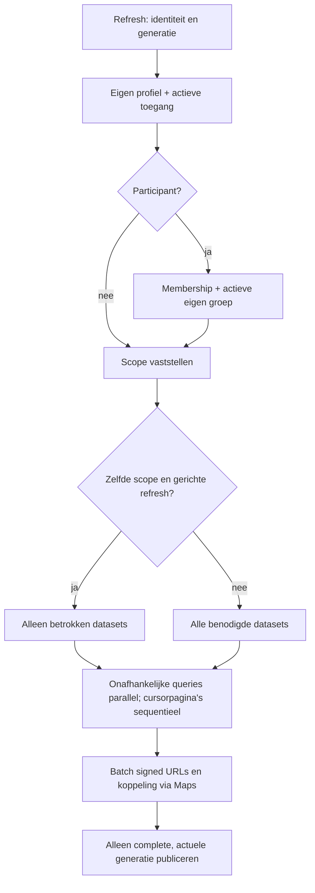

# CSI HIT — Final Capacity Validation for Realistic Game Load

Datum: 30 september 2026. Branch: `hardening/performance-scale`. Gevalideerde applicatiebasis: `453a5e03f1bfa92b8fe29421c7d8c96d6ec3a648`.

**Gereed voor production-review voor een verwacht maximum van circa 20 gelijktijdige gebruikers.** De volledige vijftienminutenrun is geslaagd, met twee extra browsers. De 25-sessiesmarge stopte na 281,50 s door één snapshot van 6,38 s; zij is niet volledig geslaagd. De twintiggebruikersacceptatie blijft volgens de afgesproken criteria geldig, met beperkte bewijsvoering voor extra tabs. Dit is een capaciteitsoordeel voor het beschreven profiel, geen Productionrelease. Production en main zijn ongewijzigd.

## Nieuwe capaciteitsafspraak

De organisator heeft de oorspronkelijke aanname van 40–50 sessies vervangen door **maximaal circa twintig gelijktijdig ingelogde gebruikers, met praktische marge richting 25 actieve sessies**. Het aantal tabs/apparaten bepaalt de technische belasting. De oude hoge stresstreden zijn geen primair releasecriterium meer; alle eerdere metingen blijven hieronder integraal als gedateerd archief behouden. Er is geen nieuwe 50/75/100-ramp uitgevoerd.

## Testbasis en fixture

Uitsluitend CSI HIT TEST `ksnagauoufsriwplvvtd`, vóór beide runs door de control plane als ACTIVE_HEALTHY bevestigd. Harde URL-, projectref-, JWT- en database-markerguards blijven actief. Geen applicatiecode, dependencies, indexes, caching, RLS, schema of compute gewijzigd ten opzichte van 453a5e0; alleen harness, meetexport en documentatie aangepast.

Herstelde normale fictieve fixture vóór de run: twee groepen, tien clues, drie notities, één transactie, één notificatie en 6.801 bestaande auditregels. Geen grote performancefixture (nul eigen grote-fixture-auditrecords). Drie rungebonden clues komen tijdens voorbereiding bij; auditgeschiedenis wordt niet als onbeperkte clientlijst geladen. Private synthetische foto: 480.613 bytes / 400×400 pixels. Schema na de functionele baseline opnieuw **790/790 gelijk**, geen migratie nodig. Baseline: 28 corechecks en 31 security/privacychecks groen (27 hosted plus vier offline privacychecks).

De eerdere kleine stressfixture had 1.209 notificaties uit recoverytests. De huidige normale fixture heeft er één bij aanvang. Ook het refreshprofiel verschilt. De nieuwe cijfers bewijzen het afgesproken scenario; zij zijn **geen gemeten versnelling door nieuwe code** of garantie voor de oude grote historie.

## Sessieverdeling

Twintig actieve API-/Realtime-sessies: twaalf participants (zes per groep), drie suspects, drie jury en twee admins. Gedurende de gehele workload lopen bovendien twee echte mobiele Preview-browsers mee (participant en jury): **22 gelijktijdige sessies in totaal**. Vijf bestaande fictieve accounts dragen meerdere sessies; twintig afzonderlijke Auth-identiteiten en alle mogelijke groepsverdelingen zijn niet apart getest. De margecontrole gebruikt 25 API-sessies zonder extra browsers (zestien participants, drie suspects, drie jury, drie admins).

## Twintig sessies gedurende vijftien minuten

Profiel A: metadata ongeveer iedere tien seconden, volledige reconciliatie na circa zestig seconden en gerichte refresh bij Realtime-events. Zeven gecontroleerde writes liggen verspreid over de vijftien minuten. De workload duurt **902.39 s**; setup en cleanup staan apart in de ruwe gegevens.

| Meting, alleen workload | 20 API + 2 browsers | 25 API, marge |
|---|---:|---:|
| Volledige snapshots p50 / p95 / p99 (ms) | 223 / 351 / 647 | 231 / 335 / 371 |
| Volledige snapshots, aantal | 280 | 100 |
| API-requests | 12302 | 4477 |
| API-requests per seconde | 13.63 | 15.90 |
| API-request p95 (ms) | 148 | 131 |
| Onverwachte API-fouten | 0 | 0 |
| Resultaat | geslaagd | gestopt op latencyguard |
| Workloadduur (s) | 902.39 | 281.50 |

Throughput betreft API-clients; de twee browserrequesttellers staan afzonderlijk in het [gesanitiseerde meetbestand](performance/realistic-capacity.json). Requestduur omvat clientoverhead en het lezen van responses. Gedecodeerde bytes zijn geen factureerbare egress. De historische summary-velden omvatten setup; bovenstaande percentielen uitsluitend volledige workload-snapshots.

Volledige snapshot-p95 per workloadminuut (ms): 1: 296; 2: 306; 3: 352; 4: 274; 5: 313; 6: 421; 7: 346; 8: 500; 9: 647; 10: 293; 11: 341; 12: 480; 13: 315; 14: 676; 15: 359. Het totaal blijft onder het acceptatiebudget van 2.000 ms. De bestaande stopgrens voor aanhoudende latency >3 s en guards op HTTP-, Realtime- en integriteitsfouten zijn niet versoepeld.

## Realtime-hotspot

Een gerichte vrijgave voor groep A bereikt alle **14 gerechtigde API-clients**. Convergentie vanaf vóór de RPC: p50/p95/p99 **1289 / 1408 / 1408 ms**. De mobiele participant toont de vrijgave eveneens. Groep B ontvangt de groepspecifieke vrijgave en notities van A niet.

In de tien seconden vanaf de release starten 169 gemeten API-requests, maximaal 48 in één seconde; request-p95 242 ms, fouten 0. Over de hele run: maximaal 81 API-requests/s en 47 afgeleverde clientevents/s (202 events totaal). Dit zijn clienttijdvakken, geen platformbilling- of serverratelimitmeters. Coalescing vermindert refreshwerk, niet eventfanout.

## Writes en exacte integriteit

Alle geplande acties voltooid: notitie via participant-UI rond minuut 1, jurycorrectie via UI rond minuut 3, aankoop A rond 5, notitie B rond 7, vrijgave rond 9, tweede jurycorrectie rond 11 en aankoop B rond 13. Exacte afrondtijden staan in het meetbestand. Beide correcties zijn met de oorspronkelijke action-ID herhaald; elke retry wijst naar dezelfde transactie. Bestaande aankoopuniqueness en RPC-autorisatie blijven leidend.

| Controle | Uitkomst |
|---|---|
| Groep A | 100 + 1 − 1 + 1 = **101** |
| Groep B | 100 − 1 = **99** |
| Runtransacties | exact 4: twee correcties en twee aankopen |
| Notities / aankopen | 2 / 2, elk exact één rij |
| Idempotente correctieretries | 2, geen extra boeking |
| Audit | één credit-insert per action-ID, één assignment-insert per aankoop, één vrijgave-update |
| Vrijgave | juiste groep, status released en released_at aanwezig |
| Groepsisolatie | geen A-hotspot of A-notitie bij B |

Notities hebben geen bestaande operation-audittrigger; hun rij, groep en zichtbaarheid zijn gecontroleerd. Alle runwrites blijven op TEST staan. De exacte IDs, action-IDs en voor-/nastate staan uitsluitend in de genegeerde lokale write-state; de gepubliceerde meetgegevens bevatten geen accounts, payloads of toegangstokens. Eindregressies gebruiken LOCAL en wissen dit hosted bewijs niet.

## Reconnect

Vijf API-clients (admin, jury, suspect, A, B) reconnecten gelijktijdig rond minuut 7,5. Totale hersteltijd inclusief twee seconden onderbreking en nieuwe snapshots: **3113 ms**. 25 joins totaal; maximaal 1 channel per API-client. De participantbrowser ondergaat daarnaast een eigen offline/online-proef en herstelt naar TESTMODUS. Geen langdurige foutstaat of dubbel clientchannel.

De server telde rond reconnect tijdelijk 189 tabelbindings en daarna weer 154 (=22×7). Dit tijdelijke aantal is geen bewijs van 27 tegelijk actieve browsers; de server ruimt oude bindings asynchroon op. Na alle load is de servercleanup apart gecontroleerd.

## Echte browsers en mobiele vertraging

Beide browsers gebruiken de READY-Preview op exact 453a5e0, viewport 390×844. Participant: 100 ms latency, 200 kB/s download, 100 kB/s upload, 4× CPU-vertraging. Jury: dezelfde viewport zonder deze netwerkvertraging. Dashboard/login, verdachtennavigatie, private foto, notitiefeedback, pegelactie, aanwijzing en Realtime-/reconnectgedrag slagen; **nul console-, page-, onverwachte netwerk- of zichtbare syncfouten**.

| Browserflow | Eenmalige waarneming (ms) |
|---|---:|
| a:login | 3238 |
| jury:login | 1071 |
| mobile:note-and-feedback | 656 |
| jury:credit-and-idempotent-retry | 469 |
| mobile:offline-online | 4396 |
| mobile:hotspot-visible | 18 |

De loginwaarden omvatten assets/invullen/wachten op de bruikbare app, tijdens setup met twintig verbonden API-clients maar vóór hun doorgaande poll-loop. Browser-creditduur omvat UI en verificatie; de idempotente retry volgt afzonderlijk. Dit zijn éénmalige flowwaarnemingen, geen statistische browser-SLA.

**Aanvulling op het browserbewijs:** de eerste hotspotassertion controleerde alleen Ontgrendeld. Dat label bestaat al bij een pending assignment; de 18 ms daarvan is uitsluitend een zichtbaarheidscontrole en geen gemeten browserpropagatie. De API-convergentie hierboven controleert wél de veranderde status en blijft geldig. De harness is aangescherpt zonder applicatiewijziging; het oorspronkelijke meetbestand is behouden.

Een gerichte aanvullende proef onder opnieuw twintig actieve API-leessessies plus twee browsers geeft één nieuwe fictieve aanwijzing via de jury-UI vrij. Binnen **1788 ms vanaf de UI-klik** retourneert de mobiele browser een nieuwe group_clues-response met de juiste released-rij én verdwijnt de pending jurykaart. Nul browserfouten; saldi ongewijzigd; precies één release-auditregel. De achtergrondrun duurt 120.00 s, snapshot-p95 330 ms, nul API-fouten. Dit is een gerichte aanvulling, geen vervanging of herhaling van de vijftienminutenrun. De twee browsers loggen hier in tijdens de doorgaande API-load. De eerste aanvullende poging stopte vóór de vrijgave op een te brede Playwright-selector (dezelfde titel in wachtrij en dossier); de selector is beperkt tot de vrijgavesectie en dezelfde pending assignment is veilig hervat. Geen extra clue of dubbele release door de herhaling.

Minuutmetingen van heap, DOM en sockets staan in het meetbestand. Er is geen geforceerde garbage collection gebruikt; veranderingen door navigatie en afvalverzameling zijn geen hard lekbewijs. Maximaal één socket per browser; vijftien minuten is geen garantie voor een volledige speldag.

## Backendmetrics, logs en advisors

26 Metrics API-samples, ongeveer één per minuut. Hoogste CPU-delta 36.87%, laagste beschikbare geheugen 100.0 MiB. Hoogste PgBouncer-wachtenden 0, PostgREST-wachtenden 1, pooltimeouts 0. De metrics gelden voor de aangeboden gedeelde node, niet dedicated CPU. Tabelbindings zijn geen connectiontelling. WAL restart-afstand is geen directe eventvertraging; de slotcontrole en echte convergentie staan afzonderlijk in de meetexport.

Logvenster 07:34–07:56 UTC: 18.886 HTTP 200, vier 201, 48 204 en 52 websocket-upgrades (101); geen 4xx/5xx. De negen Postgres-logevents hebben niveau LOG, Auth/Storage alleen info. De aanvullende browserproef heeft eveneens uitsluitend 2xx/101. Er verscheen geen afzonderlijke Realtime-logbron; nul client-Realtime-fouten is dus het directe bewijs. Eén PostgREST-event had geen severityveld en de tekstclassificatiequery was niet beschikbaar: geen volledige afwezigheid van interne logfouten claimen.

Servercontrole om 08:00:14 UTC: nul subscriptions, nul lock-wachters, nul cumulatieve deadlocks; beide logische slots actief, confirmed_lag 0/−1 bytes (meetvolgorde), restart_lag 728 bytes. Daarna is ook de eigen metricscollector gestopt. De aggregaten staan onder `logs`, `replication` en `advisors` in het meetbestand.

Advisors: twaalf bestaande [SECURITY DEFINER-meldingen](https://supabase.com/docs/guides/database/database-linter?lint=0029_authenticated_security_definer_function_executable), één [leaked-password-protectionmelding](https://supabase.com/docs/guides/auth/password-security#password-strength-and-leaked-password-protection), acht [foreign-key-indexadviezen](https://supabase.com/docs/guides/database/database-linter?lint=0001_unindexed_foreign_keys), negen [RLS-initplanadviezen](https://supabase.com/docs/guides/database/database-linter?lint=0003_auth_rls_initplan), negentien [meervoudige permissieve policies](https://supabase.com/docs/guides/database/database-linter?lint=0006_multiple_permissive_policies), twee [dubbele indexes](https://supabase.com/docs/guides/database/database-linter?lint=0009_duplicate_index) en negen [ongebruikte indexes](https://supabase.com/docs/guides/database/database-linter?lint=0005_unused_index). De laatste teller was historisch zes en is gebruiksafhankelijk; er zijn geen indexes gewijzigd. Deze adviezen zijn geen vastgesteld causaal bewijs voor de ene latency-uitschieter. Geen databaseoptimalisaties of platforminstellingen aangepast.

## Vijfentwintig sessies: operationele marge

Na de groene twintig-sessiesrun volgt één geplande read-heavy proef van 300 seconden met 25 API-sessies. **Voortijdig gestopt na 281.50 s**, snapshot-p95 335 ms, nul onverwachte HTTP-/Realtime-fouten, maximaal 1 channel per client. Eén jurysnapshot duurde 6.379 ms, waarvan een groups-request 6.332 ms; een admin-groups-request duurde 5.032 ms. Beide antwoorden waren HTTP 200. De guard gebruikt p95 over de laatste tien volledige snapshots, feitelijk het maximum bij n=10; één uitschieter volstaat dus om conservatief te stoppen. Die guard is behouden en de proef is niet opnieuw gedraaid.

Edge logs bevestigen maximaal 6.256 ms server-origin-tijd op groups rond de stop; dit is geen uitsluitend lokale clientvertraging. Minuutmetrics tonen geen aanhoudende poolwachtrij of uitputting; geen deadlocks of database-errorlogs gevonden. De precieze oorzaak van deze korte vertraging is niet vastgesteld. De totale workload-p95 is ruim onder 2 s, maar een geheel groene vijfminutenmarge wordt niet geclaimd. De eis staat toe dat een minder sterke 25-sessiesmarge de geslaagde twintiggebruikersacceptatie niet automatisch blokkeert. De volledige duurtest bewijst al 22 gelijktijdige sessies; voor 25 blijven incidenteel trage responses een operationeel aandachtspunt.

## Bekende stressgrenzen en veilige capaciteit

Verwacht gebruik: circa **twintig gebruikers**, met beperkte normale writes en de beschreven kleine dataomvang. Operationele marge: 22 sessies tijdens de volledige duurtest bewezen; richting 25 is de marge **beperkt**, met één voortijdige latency-stop ondanks gezonde totale p95. Houd extra tabs beperkt en observeer synchronisatie. Hogere zware concurrency en grote historie zijn ongevalideerd/afgekeurd en geen onderdeel van deze vrijgave voor review.

Historisch: 25 B-reads p95 1.514 ms geslaagd; 25 C-piek p95 3.504 ms afgekeurd; 50 B-reads p95 4.198 ms afgekeurd; grote fixture bij vijf sessies p95 11.502 ms afgekeurd. Er is geen afzonderlijke 40-sessiesrun geweest. De oude C-proef bevatte zes geclusterde logische writes met full refresh iedere 2,5 s; niet alle clients schreven voortdurend. De volledige oude meettabellen blijven in het archief hieronder staan.

## Infrastructuur- en planadvies

De huidige Free/Nano-infrastructuur is voldoende aangetoond voor **het twintiggebruikersprofiel**, met twee extra browsers, writes en reconnect. Er wordt geen onvoorwaardelijke capaciteit van 25 sessies toegezegd. De korte 25-sessiesuitschieter verdient observatie bij de pre-eventcheck; deze proef levert geen bewijs dat een betaalde upgrade noodzakelijk is of het probleem gegarandeerd oplost. Een upgrade volgt evenmin uit het falen van de oude vijftig-sessiesstress. Geen plan of compute gewijzigd. Bij sterk groeiende historie, meer apparaten of wezenlijk andere speldata moet opnieuw worden gemeten; de oude grote-fixturegrens blijft relevant.

Plan- en quota-inventarisatie van 29 september staat gedateerd in het archief. Die gebruiksstanden zijn geen actuele rekening van deze run. Controleer quota, databereik, actieve tabs en Free-projectstatus opnieuw vóór het evenement.

## Pre-event check vóór Pasen 2027

Gebruik op gezonde TEST tien sessies, drie minuten profiel A, zes beperkte writes, hotspot en reconnect; één mobiele browser erbij. Exact commando en criteria staan in het [draaiboek](../tests/performance/README.md#korte-check-vóór-pasen-2027). Streef workload-p95 ≤2 s, nul onverwachte fouten, correcte saldi en geen subscriptiongroei. Vergelijk dataset/plan met deze baseline. Geen load op Production, niet opschalen bij regressie. Volg tijdens het spel het [incidentdraaiboek](GAME-DAY-INCIDENT-RUNBOOK.md).

## Eindregressies

Na beide capacityruns opnieuw een schone `npm ci`, volledige lokale quality gate, core reliability, security, browserflows, lint, build, audit, diffcheck en secretscan. Alle hieronder genoemde checks slagen op de eigen lokale backend; de hosted writes blijven behouden.

| Suite | Checks |
|---|---:|
| Vitest | 49 |
| Static/config/recovery/privacy/performanceguards | 43 |
| Core database | 28 |
| Security/auth/privacy | 31 |
| Browser E2E incl. responsive | 22 |
| Security browser | 8 |
| Uitvoeringen / uniek | **181 / 177** |

Vier privacychecks worden in twee suites uitgevoerd. Twee nieuwe acceptanceguards zijn inbegrepen in de 43 staticchecks. Audit: nul kwetsbaarheden. De eerdere volledige 210-unieke-testvalidatie blijft historische basis; niet alle recovery/performance-integraties zijn deze keer herhaald. De totale testsuite heeft nu twee extra guards, maar dat is geen claim dat 212 tests in deze eindronde draaiden.

## Git en Preview

Applicatiebasis **453a5e0** blijft identiek in src, dependencies, buildconfig en SQL. Alleen rapport/testharnesswijzigingen gaan naar dezelfde branch. De afsluitende commit en de controle van zijn CI/Preview staan in het opleverbericht; geen main-merge.

De echte browseracceptatie gebruikt [Preview 453a5e0](https://hit-csi-1-11-nouiydve8-rforman89s-projects.vercel.app), deployment `dpl_8bnuvtNP3qDGvjt9K5Z11dgneg5R`, READY. Buildmetadata en werkelijk gebruikte backend zijn TEST. Deze immutable deployment blijft het bewijs bij de run. De nieuwe rapport/harnesscommit krijgt een eigen Preview met dezelfde applicatiebron; dat onderscheid wordt niet weggewerkt door het meetcommit te vervangen. [Branchpreview](https://hit-csi-1-11-git-hardening-performan-f94ec7-rforman89s-projects.vercel.app). Credentials, authstate, ruwe logs en backups blijven buiten Git.

## Production en projectstatus

Production `uhfcrskkgutlqqogahbr` is in deze acceptatie niet benaderd voor queries, wijzigingen of load. Main blijft `8ef8beec9b76859cc4f858f34898d5def3b22d67`. Geen Productiondeployment, migratie, migration-history-repair of configuratiewijziging. IScout blijft door de operator gepauzeerd tijdens het hosted venster.

Na beëindiging van alle workloads, browsercleanup, nul server-subscriptions en de laatste CI/Previewcontrole kan CSI HIT TEST veilig worden gepauzeerd en IScout worden hervat. De operator voert deze statuswissel uit; scripts doen dat niet automatisch.

## Resterende grenzen en conclusie

De fixture heeft twee actieve testgroepen en vijf gedeelde testaccounts. Andere groepsspreiding, veel meer historische rijen, hoge-resolutiefoto's, een hele speldag en zwaardere concurrentie zijn hiermee niet algemeen gegarandeerd. De bekende RLS/security-advisors en migration-historyvragen blijven bestaande reviewonderwerpen, zonder nieuwe wijzigingen in deze opdracht.

**Gereed voor production-review voor een verwacht maximum van circa 20 gelijktijdige gebruikers.**

---

# Historisch archief — metingen en besluit van 29 september 2026

Onderstaande oorspronkelijke rapportage is behouden voor traceerbaarheid. Haar capaciteitseis van 40–50 sessies en bijbehorende afwijzende conclusie zijn **vervangen door de acceptatie hierboven**. De stressmetingen zelf blijven geldig als bovengrensinformatie, niet als huidig primair releasecriterium. Genummerde paragraafverwijzingen binnen dit archief verwijzen uitsluitend naar het oude rapport. Historische Productioninventarisatie is niet herhaald in de nieuwe acceptatie.

Datum: 29 september 2026. Status: hosted validatie afgerond; capaciteit voor het beoogde spelgebruik onvoldoende. Basis: `8ef8beec9b76859cc4f858f34898d5def3b22d67`. Branch: `hardening/performance-scale`.

## 1. Executive summary

De lokale fase vindt en herstelt stille truncatie boven de API-rowlimit, herhaalde volledige datalaadcycli en zware pegel-/aanwijzingenlijsten. Geen spelregels, SQL-migraties, RLS/grants, dependencies of productie-instellingen gewijzigd. De wijzigingen behouden de bestaande autorisatie- en mutatieprocedures. Ongewijzigde private foto-URLs worden binnen hun geldigheid hergebruikt, uitsluitend in de state van dezelfde toegangscontext.

**Nog niet gereed voor production-review.** Na het lokale checkpoint is TEST door de operator hervat. Hosted reads slagen tot 25 sessies met de kleine fixture; 50 sessies stoppen op het latencybudget. De volledige schrijfmix slaagt bij 10, maar niet bij 25 sessies. De grote fixture stopt al bij vijf sessies. Het voorlopige gebruik van circa 40 sessies is dus niet met marge bewezen. Reconnect, gerichte browser-E2E en duurmetingen staan hieronder; geen Productionrelease binnen deze opdracht.

## 2. Verwacht spelgebruik

Read-only inventarisatie bij start: zes actieve groepen, zeven participantaccounts, twee adminaccounts, twee suspectaccounts, acht actieve verdachtendossiers en geen juryaccounts. Dit zijn configuratieaantallen, geen aanmeldlijst of capaciteitsvraag. Er zijn geen namen of e-mailadressen uit Production opgehaald.

Voorlopige aanname zolang de organisator de aantallen niet heeft bevestigd: zes groepen × drie telefoons = achttien participantapparaten, acht verdachteapparaten, vier juryapparaten en twee beheerapparaten = 32 apparaten. Gemiddeld 1,25 open tabs geeft circa **40 actieve sessies/Realtime-verbindingen**. Aantal personen kan veel hoger zijn dan aantal apparaten; een gedeeld account kan meerdere apparaten bedienen. Voorgesteld ontwerpdoel: **50 actieve sessies**, hosted testplafond **100**, uitsluitend na gezonde lagere treden. Geen van deze getallen is al een operationeel maximum.

| Rol | Werkelijk aanwezige kernflows | Databereik |
|---|---|---|
| Participant | dashboard, verdachten/clues, notities/status, betaalde aankoop, refresh | eigen actieve groep, gemaskeerde clues |
| Suspect | eigen dossier, groepsnotities/status, agenda/navigatie | bestaande suspect-RLS; geen algemene transactielijst |
| Jury | dossiers, clue vrijgeven, pegelcorrectie, groepen vergelijken | jury-RLS, geen beheer/reset/backuprechten |
| Admin | spelmonitoring, beheer, instellingen, backupstatus, uitzonderingen | volledige toegestane datasets; backuphealth via begrensde RPC |

## 3. Baseline

Vóór bronwijzigingen gemeten met de echte lokale backend, gebouwde Vite-app, Chromium, viewport 390×844. Loginmeting omvat laden van assets, geautomatiseerd invullen en wachten tot de uitlogknop bruikbaar is. Iedere rol krijgt een eigen context; na initialisatie en schermwissels volgt 22 s idle (publieke pagina's 1 s). Latencywaarden zijn labwaarnemingen, geen statistisch gevalideerde SLA.

Oorspronkelijk: landing 129 ms, login 98 ms; participant 970 ms, suspect 415 ms, jury 372 ms, admin 433 ms. Totale backendrequests per sessie respectievelijk 60/49/61/65 voor de vier ingelogde rollen; daarin zitten login, Storage en twee idle-polls. De fixture bevat veel meldingen: participant idle downloadde circa 617 kB aan gedecodeerde backendresponses. Dit is geen verwachting voor iedere echte groep.

Een herhaalde vergelijking vanuit Git `8ef8bee` en de gewijzigde loader/refreshbron gebruikt dezelfde fixtures zonder muterende tests ertussen. De later begrensde cluekaarten worden apart op dezelfde grote fixture voor/na gemeten in §10; de normale profiler bezoekt die clueweergave niet. Zie de volgende automatisch samengevatte metingen en [machineleesbare meetgegevens](performance/measurements.json). Volledige ruwe logs blijven onder genegeerde `.local/performance/`.

<!-- MEASUREMENTS START -->
| Rol | Bruikbaar vóór → na (ms) | Backendrequests vóór → na | Idle requests vóór → na (22 s) | Idle responsebytes vóór → na |
|---|---:|---:|---:|---:|
| landing | 145 → 132 | 0 → 0 | 0 → 0 | 0 → 0 |
| login | 99 → 102 | 0 → 0 | 0 → 0 | 0 → 0 |
| a | 966 → 961 | 60 → 44 | 30 → 12 | 620356 → 3578 |
| suspect | 436 → 349 | 49 → 32 | 24 → 12 | 5080 → 2412 |
| jury | 445 → 344 | 61 → 35 | 30 → 12 | 21002 → 4222 |
| admin | 495 → 464 | 65 → 45 | 32 → 12 | 705800 → 4328 |

Landing/login gebruiken 1 s idle. Backendrequests omvatten auth/REST/Storage; bytes zijn gedecodeerde responsebytes, geen gemeten internet-egress. Volledige snapshots vóór optimalisatie kunnen afgekapt zijn; na optimalisatie worden alle pagina’s geladen. Dit verklaart een deel van extra initial requests.

Lokale tien-sessiesrun: 60.01 s workload, 68.52 s inclusief setup/cleanup; 775 requests, 11.31/s over de hele run; fouten 0. Snapshot p50/p95/p99 **48.91/209.33/235.18 ms**, request p95 **41.73 ms**, 20 joins inclusief reconnect. Dit is lokale API-/Realtime-validatie, geen hosted capaciteitsgrens.
<!-- MEASUREMENTS END -->

De eerste detector telde gelijke endpointpaden binnen 1,5 s; dat bewijst geen identieke query, omdat eigen profiel/adminlijst en verschillende cursorpagina's hetzelfde pad gebruiken. De herhaalde profiler vergelijkt daarom hashes van methode, volledige URL en body. Identieke reads bij de eerste subscription blijven deels bewust nodig om wijzigingen tussen snapshot en subscription op te vangen. Formulierblur zonder wijziging veroorzaakt nu nul reads, afzonderlijk bewezen in een browserregressie.

## 4. Gevonden bottlenecks

- Ongelimiteerde `.select('*')` stopte bij 1.000 rijen: de grote fixture leverde precies 1.000 transacties, notities en clues, zonder foutmelding.
- Elke idle-poll laadde het hele spel; ieder Realtime-event plande opnieuw een volledige laadcyclus. Een ongewijzigd formulier verlaten triggerde eveneens een full refresh.
- Afzonderlijke signed-URL-aanvragen en sequentiële datasets verlengden de waterfall. Dubbele `SIGNED_IN`-events konden opnieuw laden.
- Grote pegelhistorie bouwde circa 7.699 DOM-elementen op. De gemeten schermwissel duurde circa 201 ms.
- Een volledige snapshot had een limiet van 8 s; op het trage lokale netwerk werd admin niet bruikbaar. Paginering mag bij een latere fout geen gedeeltelijke data publiceren.

## 5. Wijzigingen

`readAllRows` zorgt voor expliciete keysetpaginering. `loadAppSnapshot` hercontroleert profiel en membership en hergebruikt alleen state van dezelfde gebruiker/rol/groep. Onafhankelijke datasets lopen parallel. Foto-URL's worden per batch ondertekend. `refreshQueue` bundelt dirty-tabellen gedurende 300 ms, bewaart events tijdens typen of busy state en voert achtergrondrefreshes achtereenvolgens uit. Geen gedeelde cache of nieuwe dependency.

`App.jsx` gebruikt gerichte eventrefresh, een lichte poll iedere 10–11 s en volledige reconciliatie na circa 60 s. Bij ontbrekende Realtime-verbinding blijft de volledige poll beschikbaar. Online/visibility, accountwissel, handmatige refresh en eigen mutaties behouden volledige actualisatie. De eerste subscription en reconnect halen alle zeven geabonneerde datasets opnieuw op om het subscriptiongat te sluiten. Alle snapshots hebben een begrensde deadline van 30 s: ook een gerichte subscription-refresh kan een grote gepagineerde dataset bevatten. De laatste trage-netwerkproef wees uit dat de eerdere 8 s-grens daar nog sync-fouten veroorzaakte; deze grens is daarom gelijkgetrokken. Een fout bewaart zichtbare laatste data en zet spelmodus op onbekend; serverautorisatie blijft beslissend.

## 6. Queryoptimalisatie

Queries op groeiende datasets staan centraal in de loader. De drie overige `.select('*')`-plaatsen in `App.jsx` retourneren uitsluitend zojuist ingevoegde, begrensde demofixtrijen; ze downloaden geen groeiende tabel. Profielupdate vraagt één ID terug. Eigen profiel is één rij; membership is begrensd door de bestaande unieke user-ID. Admin/jury blijven datasets lezen die dashboards en exports werkelijk gebruiken. Alleen visuele lijsten beperken zonder de datalaag compleet te houden zou exports/saldo-overzichten breken.

Model bij kleine datasets (één pagina per dataset, één fotobatch, actief tabblad, stabiele Realtime): participant volledige snapshot ongeveer 13 backendcalls inclusief signing, gerichte metadata-poll 6 zolang foto-URLs geldig blijven; admin ongeveer 15/6, plus backuphealth iedere 30 s. Fotovernieuwing voegt een signingcall en eventueel een image-GET toe. De veiligheidshercontrole op profiel/membership wordt bewust niet gecachet. Elke extra 250 rijen in een geladen dataset voegt een cursorrequest toe; exact multiples kunnen een lege eindpagina vergen.

Conservatief rekenmodel voor deelnemers, exclusief login, events en mutaties: voorheen 6 × 15 = **90 calls/min/client** voor de oorspronkelijke fixture inclusief twee signingcalls en één zichtbare image-GET per poll; nu 5 × 6 + 13 + 1 image-GET = **44/min/client**. Het nieuwe model rekent voorzichtig op één fotovernieuwing per minuut terwijl ongewijzigde URLs normaal circa vier minuten meegaan. Werkelijke 10–11 s jitter verlaagt het gemiddelde iets. Gebruik de gemeten endpointtellingen voor de concrete fixture; dit model schaalt niet lineair naar grote datasets of hosted compute.

| Actieve apparaten met één tab | Oud model calls/min | Nieuw model calls/min | Nieuw gemiddeld calls/s |
|---:|---:|---:|---:|
| 10 | 900 | 440 | 7,3 |
| 25 | 2.250 | 1.100 | 18,3 |
| 50 | 4.500 | 2.200 | 36,7 |
| 100 | 9.000 | 4.400 | 73,3 |

Navigatie zonder een mutatie vraagt geen nieuwe dataset. Een groep/saldo-event kan bij een participant volstaan met profiel + membership; een mutatie kan meerdere tabellen raken. De queue neemt daarvan de unie. Een eigen schrijfactie behoudt volledige refresh voor correctness. Parallelisatie verlaagt waterfallduur maar verhoogt de korte querypiek; de hosted ramp toont dat de pieklatency op Nano de capaciteit begrenst (§13).

## 7. Pagination

Cursor op unieke `id`, of `key` voor settings; pagina's van 250, eerste pagina met exact count. Ook bij een lagere server-rowlimit gaat de helper door. Een ongeldige/teruglopende cursor, abort of fout op een latere pagina breekt de hele snapshot af. Maximaal 200 pagina's, daarna een expliciete fout in plaats van afgekapt publiceren. De bestaande displaysortering wordt na de volledige fetch hersteld.

Grote lokale fixture: oud 1.000/1.000/1.000; nieuw **1.508 transacties, 1.205 notities, 1.102 clues**, inclusief bestaande fixtures. Alle 1.500/1.200/1.100 deterministische IDs en alle 2.500 auditfixture-IDs zijn afzonderlijk gecontroleerd. Transactiesommen zijn correct en de toegevoegde transacties zijn netto nul. Laatst gemeten loaderduur: oud 346 ms voor onvolledige data, nieuw 675 ms voor volledige data. Dit is een correctnessverbetering, geen latencywinst claimen bij ongelijke hoeveelheden data.

Audit/backupstatus wordt niet als onbegrensde browserlijst geladen. Backupcapture gebruikt de bestaande server-side snapshotprocedure; de hersteltests bewijzen die route opnieuw. Paginering is geen databasebrede point-in-time snapshot: gelijktijdige insert/delete kan tussen cursorpagina's veranderen. De volgende reconciliatie corrigeert dit. Voor een consistente operationele backup blijft de bestaande backup-RPC leidend. Zeer grote volledige exports blijven een mogelijk toekomstig server-side werkpunt; daar is nu geen nieuwe RPC voor ingevoerd.

## 8. Indexes/queryplans

Lokaal `EXPLAIN (ANALYZE, BUFFERS)` als authenticated admin met dezelfde RLS en grote fixture, uitsluitend lokaal:

| Query, eerste 250 op ID | Plan | Execution time |
|---|---|---:|
| transacties, group-ID | bitmap op `idx_credit_transactions_group_id`, heap/RLS, sort | 24,864 ms |
| notities, group-ID | `idx_suspect_notes_group_id`, RLS, sort | 16,316 ms |
| audit op ID | `operation_audit_pkey` | 1,806 ms |

Bestaande membership-, group-, suspect-, timestamp- en unieke action-ID-indexes zijn aanwezig. De gefilterde plannen gebruiken bestaande indexes; de sort kost bij deze fixture relatief weinig naast de geautoriseerde scan. Geen gemeten indexbottleneck die een extra migratie rechtvaardigt. Geen index/RPC-migratie toegevoegd. Dit bewijs geldt niet voor honderdduizenden rijen of Nano onder load; hosted slow-querydata kan een later indexbesluit rechtvaardigen.

Hosted advisors na de ramp: acht [foreign keys zonder covering index](https://supabase.com/docs/guides/database/database-linter?lint=0001_unindexed_foreign_keys), negen [RLS initplan-waarschuwingen](https://supabase.com/docs/guides/database/database-linter?lint=0003_auth_rls_initplan), negentien [meervoudige permissieve policies](https://supabase.com/docs/guides/database/database-linter?lint=0006_multiple_permissive_policies) en twee [dubbele indexes](https://supabase.com/docs/guides/database/database-linter?lint=0009_duplicate_index). Ongewijzigd ten opzichte van de baseline; ongebruikte indexes daalden van acht naar zes doordat tests extra paden gebruikten. Dit is geen opdracht om indexes blind toe te voegen/verwijderen. Queryplannen en RLS-kosten moeten samen worden gemeten.

Security advisors blijven twaalf [authenticated SECURITY DEFINER-RPC’s](https://supabase.com/docs/guides/database/database-linter?lint=0029_authenticated_security_definer_function_executable) en één melding voor [uitgeschakelde leaked-password-protection](https://supabase.com/docs/guides/auth/password-security#password-strength-and-leaked-password-protection). De bestaande RPC-rolcontroles zijn door de securitysuite getest; de meldingen worden niet als nieuw geïntroduceerde fouten of als automatisch opgelost beschouwd. Geen Auth-instelling gewijzigd. De schemahercontrole na de functionele/loadtests telt opnieuw 790/790 gelijke onderdelen.

## 9. Realtime

Per ingelogde client één channel met zeven Postgres Changes-bindings: groups, group_clues, notifications, credit_transactions, agenda_items, suspect_notes en suspect_statuses. Bestaande RLS begrenst eventtoegang. Geen nieuwe subscription op `clues_base`: die tabel bevat onderliggende cluegegevens en de veilige gemaskeerde view blijft leidend. Settings en metadata blijven via polling actueel.

Voorheen leidde ieder ontvangen event tot een full refresh na 1 s trailing debounce; events tijdens typen werden weggegooid. Nu: vaste 300 ms bundelperiode, dirty-set, maximaal één achtergrondrefresh tegelijk en één vervolg voor events tijdens de lopende refresh. Polling/reconciliatie vangt gemiste events/deletes op. De periodieke veiligheidspoll blijft ook tijdens formulierfocus lopen: conceptvelden blijven behouden, terwijl saldo/toegang niet onbeperkt achterblijven. Dit heeft een eigen browserregressie. Niet verborgen op de achtergrond blijven ophalen; een zichtbaar geworden tab vraagt actuele data.

Vijf lokale group-events in één transactie convergeren in de browser met maximaal zes REST-reads; de testgrens is acht seconden inclusief lokale backend. Vijf login/accountwissels leveren steeds één actieve channel en nul na logout. Offline/online houdt de refreshburst onder veertig reads. Dit zijn beperkte regressies, geen hosted storm- of 30-minutenleakbewijs.

## 10. Frontend/rendering

De gemeten transactielijst toont initieel 50 rijen, per klik 50 meer. Volledige data blijft in state voor cijfers en export. Zelfde grote fixture: **7.699 → 410 DOM-elementen**, schermwissel **201 → 62 ms**.

De aanvullende grote-lijstenproef vond hetzelfde probleem bij clues. Alleen de zichtbare kaarten in admin/participant zijn per categorie begrensd op 50 met een knop voor meer; categorieaantallen, betaalbaarheid en de volledige admin-toewijzingskeuze blijven intact.

| Scherm met 1.102 clues | Voor | Na | DOM voor → na |
|---|---:|---:|---:|
| Admin aanwijzingen | 298 ms | 94 ms | 13.331 → 1.782 |
| Participant aanwijzingen | 344 ms | 62 ms | 14.411 → 762 |

De browserregressie controleert op beide rollen de initiële grens en doorgaan naar 100 aanwijzingen, naast de pegelhistorie. Een suspect met 1.208 notities had circa 4.984 DOM-elementen en werd lokaal in 2,59 s bruikbaar; recente notities zijn al begrensd tot drie en groepsdossiers blijven compleet. Daar is geen extra renderingwijziging voor ingevoerd; de hosted grote-fixturemeting bevestigt langere eerste laadtijden (§16). Audit wordt niet als lange browserlijst geladen en de groepslijsten zijn bij de fixture klein.

Reactcommits, TaskDuration, JS heap en DOM zijn via test-only instrumentatie verzameld. Geen grote contextrefactor, algemene memoization of virtualisatie: daarvoor is nog geen afzonderlijk profielbewijs. Review van hooks, cleanup, stable keys en stategebruik uitgevoerd met de React-best-practicesrichtlijnen. Profilerhooks worden niet in de productiebuild opgenomen.

## 11. Bundle/assets

Baseline JS 607,59 kB, gzip circa 162,21 kB; gewijzigde build circa 611,56 kB, gzip 163,52 kB (dezelfde Vite-buildmeting). CSS circa 0,40 kB / gzip 0,24 kB. Groei circa 4,0 kB ongecomprimeerd en 1,3 kB gzip door correctheids-/queuecode; geen nieuwe packages. Grootste bijdragen vóór chunkminificatie: React DOM, App.jsx, Supabase Auth, Phoenix/Realtime en Storage. `bundle-profile.mjs` legt modulegroottes en de daadwerkelijk geschreven assetgroottes vast zonder shipped instrumentatie. Die modulegroottes zijn geen optelbare gzipbijdragen; de in-memory analysebuild kan een iets andere minificatie/compressie hebben.

Geen code-splittingwijziging: bundling/lazy-loading vraagt ook chunkfailure- en deploy-skewafhandeling; daarvoor ontbreekt nu meetbewijs van netto winst. Private foto's/downloads en signed URLs blijven behouden; batch signing vermindert het aantal signingcalls zonder publieke bucket. URLs verlopen na 300 s en worden tijdens actieve synchronisatie vernieuwd. Bestaande uploadvalidatie en veilige URL-pathcontrole blijven actief. Geen Productionbestanden gedownload voor assetinventarisatie.

Een aanvullende read-only Storage-aggregatie (2 s querylimiet, geen objectnamen/content) vond in Production één foto van **490.446 bytes**, plus zeven cluebestanden samen 704.048 bytes, grootste 140.728 bytes. De profiler toonde foto-GETs bij polling doordat signed URLs veranderden. Nu blijven URLs maximaal 240 s gelijk, met 60 s marge op hun geldigheid van 300 s. Nieuw pad, gewijzigde scope, logout en vervaldatum dwingen opnieuw ondertekenen af. Alleen de huidige foto-URLs blijven in het geheugen; geen lokale opslag/global cache. Een bestaand object extern onder hetzelfde pad overschrijven kan daardoor tot de volgende vernieuwing oud beeld tonen; app-uploads gebruiken nieuwe objectpaden. Twee regressies controleren vernieuwing, scope-/padwissel en een onvolledige signingbatch.

Het statische logo is 30.338 bytes, favicon 35.611 bytes en font 12.960 bytes. Er is geen meetreden voor een nieuwe imagepipeline. Productiefotoresoluties zijn niet uit bestanden gelezen; hosted mobiel gebruikt een private fictieve foto van 480.613 bytes (§16). Uploadgrenzen (10 MiB foto, 25 MiB cluebestand) zijn veiligheidsgrenzen, geen performance-aanbeveling.

Vercel serveert contenthash-assets; lokale testserver gebruikt `no-store` en geen gzip. Trage simulatie (200 ms latency, 50 kB/s, CPU ×4) kost daarom alleen voor de JS-bundle al circa twaalf seconden. De eerste baseline-admin werd niet bruikbaar binnen de testlimiet. Een tussenmeting vond daarna nog een gerichte-refresh-timeout bij participant/admin; beide rollen zijn na de snapshotcorrectie opnieuw geslaagd zonder zichtbare sync-fouten: participant 23.294 ms, admin 24.316 ms. De laatste formulierfocus-safeguard verandert deze read-only flows niet en krijgt daarnaast een eigen browsertest. De meetgegevens onderscheiden de runs expliciet. Dit is geen acceptabele echte mobiel-SLA en ook geen bewijs dat Vercel zo langzaam is. De afzonderlijke hosted CDN-/mobiele metingen staan in §16.

## 12. Loadtestontwerp

Eigen compacte harness met reeds aanwezige Supabase SDK, Node en Playwright; geen extra loadframework. Vier profielen A/B/C/D, rolverdeling, fictieve seed, veiligheid en exacte commando's staan in het [draaiboek](../tests/performance/README.md). De CLI accepteert alleen loopback of de exacte TEST-ref. Production, andere hosts, redirects, onbegrensde duur/concurrency, lokale writes en lokale stress worden geweigerd.

Praktische budgets voor de hosted validatie: individuele read p95 ≤750 ms, snapshot p95 ≤3 s, mutatie p95 ≤2 s, event→zichtbaar p95 ≤3 s, normale mobiele eerste bruikbaarheid ≤5 s en warme schermwissel ≤200 ms. Metadata/settings zonder event mogen circa 11 s + querytijd nodig hebben. Geen nieuwe backendfouten of integriteitsafwijkingen accepteren; 429/5xx/Realtime-fouten stoppen direct. Deze budgets zijn acceptatiecriteria, geen al bewezen resultaten.

Read-ramp 5/10/25/50/75/100, 120 s per trede. Schrijftest begint bij tien; controleert twee groepen, kleine schrijfmix en idempotency. Reconnect apart, vervolgens browser-E2E onder achtergrondreads en een soak van vijftien minuten op een gezonde trede. Verwachte totale hostedduur 45–60 minuten bij gezonde setup. Maximaal honderd, geen verplicht te halen doel.

## 13. Hosted loadresults

Gehost op uitsluitend `ksnagauoufsriwplvvtd`, vooraf telkens `ACTIVE_HEALTHY`. Het TEST-schema kwam op 790 onderdelen overeen met de vastgelegde Production-catalogus; geen migratie nodig. Kleine fixture bij start: vier transacties, drie notities, vier clues, 1.209 notificaties en 1.185 auditregels. De notificatiehistorie komt grotendeels uit de fictieve herstelproef; dit is geen leeg spel en geen exacte kopie van een gemiddelde groep. De bestandsnamen `hosted-normal-*` verwijzen naar deze fixture. De grote fixture voegt 1.500 transacties, 1.200 notities, 1.100 clues, 2.500 eigen auditregels en zes groepen toe.

| Scenario | Sessies | Geplande workload | Snapshot p50 / p95 / p99 (ms) | Requests | Fouten HTTP | Resultaat |
|---|---:|---:|---:|---:|---:|---|
| Kleine fixture B | 5 | 120 s | 272 / 779 / 897 | 1.623 | 0 | geslaagd |
| Kleine fixture B | 10 | 120 s | 350 / 866 / 1.243 | 3.282 | 0 | geslaagd, plus afzonderlijke browserrolprofielen |
| Kleine fixture B | 25 | 120 s | 364 / 1.514 / 2.090 | 7.639 | 0 | geslaagd |
| Kleine fixture B | 50 | 120 s | 691 / 4.198 / 4.890 | 2.059 | 0 | gestopt na 13,53 s workload |
| Kleine fixture C + writes | 10 | 120 s | 318 / 874 / 1.254 | 5.689 | 0 | geslaagd, volledige integriteit |
| Kleine fixture C + writes | 25 | 120 s | 698 / 3.504 / 4.042 | 1.109 | 0 | gestopt; gedeeltelijke schrijfmix |
| Grote fixture B | 5 | 120 s | 4.438 / 11.502 / 11.502 | 393 | 0 | gestopt na 17,72 s workload |
| Kleine fixture B, reconnect | 10 | 120 s | 452 / 1373 / 1783 | 3334 | 0 | geslaagd |
| Kleine fixture A, duurtest | 10 | 900 s | 540 / 912 / 1264 | 6814 | 0 | geslaagd |

De hogere treden 75/100 en profiel D zijn wegens de stopgrens niet uitgevoerd. Nul HTTP-fouten maakt een overschreden latencybudget niet alsnog geslaagd. Percentielen hierboven bevatten setup/full snapshots; het [meetbestand](performance/hosted-measurements.json) bevat apart workloadduur, rolverdeling, p50/p95/p99, throughput, tijdvakken en failures. Throughput inclusief setup/cleanup: respectievelijk 12,52 / 23,53 / 46,67 / 20,36 / 40,88 / 21,07 / 7,61 requests/s voor de eerste zeven rijen; reconnect 23,85/s en soak 7,42/s. Het aantal budgetmeldingen kan groter dan één zijn doordat al lopende snapshots na de eerste stopgrens afronden; dat zijn geen afzonderlijke HTTP-fouten.

## 14. Realtime load

Tien sessies met volledige schrijfmix leverden 84 tabel-events af, maximaal 52 in één clienttijdvak van een seconde. Zeven gerechtigde clients zagen de gerichte clue-release: mediaan 1.880 ms, p95/maximaal 2.102 ms. Groep B zag de groepspecifieke hotspot niet. De run met 25 sessies piekte op 134 afgeleverde events in één clienttijdvak; dat waarschuwt voor fanout rond de Free-grens van 100 messages/s, maar bewijst geen server-side ratelimiting. Er waren geen Realtime-foutmeldingen. De vertraagde snapshots zijn wel reden om die trede af te keuren.

Alle API-sessies hebben één channel met zeven tabelbindings. De servermetric subscriptions telt bindings, niet browsers of verbindingen. Na de gestopte 50-sessiesrun keerde deze metric terug naar nul. Gelijktijdige reconnect van tien sessies: geslaagd, twintig joins totaal, hele reconnect inclusief nieuwe snapshots 2250 ms. Snapshot p50/p95/p99 452 / 1373 / 1783 ms; maximaal één channel per client. De duurproef staat in §17. De hogere stormtreden zijn wegens de latency-stopgrens niet uitgevoerd. Coalescing verlaagt REST-werk, niet de fanout van Realtime.

## 15. Data-integriteit

De hosted schrijftest met tien sessies voltooide twee notities, twee aankopen, één jurycorrectie met dezelfde action-ID als retry en één clue-release. Saldi, unieke transacties/aankopen, auditregistraties en zichtbaarheid bij gerechtigde clients kloppen. Gemeten RPC-duur: jurycorrectie 99 ms, retry 54 ms, notities maximaal 80 ms, aankopen maximaal 98 ms, release 60 ms. Dit is een kleine begrensde schrijfmix, geen statistische mutatie-p95 over honderden acties.

De 25-sessiesrun stopte na 7,94 s workload vóór alle zes acties klaar waren. De eerste integriteitshelper meldde daarom een ontbrekende tweede notitie. Afzonderlijke controle van alle daadwerkelijk afgeronde acties vond geen corruptie: groep A 100→101, groep B 99→98, één notitie en aankoop voor B, één jurytransactie ondanks retry en correcte release/audit. De harness controleert nu eerst voltooide acties en vereist daarna de volledige mix voor een geslaagde run. Deze run blijft afgekeurd.

Een echte hosted adminloader las de grote fixture compleet: 1.509 transacties, 1.206 notities, 1.110 clues en alle 2.500 eigen auditregels. Alle verwachte deterministische IDs waren aanwezig. De grote fixture is daarna verwijderd op uitsluitend eigen IDs, via bestaande geautoriseerde routes; de loadwrite-historie blijft voor inspectie staan. Geen grants/RLS versoepeld. Lokale atomiciteit, retry, backup/restore en paginering blijven afzonderlijk bewezen.

## 16. E2E onder load

Op de geverifieerde Vercel Preview slagen vijf gerichte E2E-cases onder tien API-sessies en één extra adminbrowser: creditactie met vertraagd antwoord/dubbelklik/twee-client-sync, globale clue-/modussync, notitie dubbel verzenden + status, participant-aankoop en verdachteweergave op acht viewports. De aparte jurybrowsercase met echte credit-/release-RPC en private foto slaagt ook. Maximaal twee extra E2E-browsers tegelijk: dus dertien sessies tijdens die flows. Dit is geen volledige 13-sessies capaciteitstrede. De 22 reguliere E2E-, acht securitybrowser- en twee recoverybrowsercases zijn apart zonder load groen.

Mobiele profielen gebruiken 390×844, CPU ×4, 4G-simulatie 80 ms/200 kB/s of traag 200 ms/50 kB/s en een private fictieve PNG van 480.613 bytes. Eén profielbrowser tegelijk komt bovenop de tien API-clients en de duurtestbrowser. De onderstaande tijden omvatten assets/login en wachten op de bruikbare app; één observatie per rol, geen SLA-percentiel. Grote fixture apart gemeten zonder API-load na haar afgekeurde vijf-sessiestrede.

| Dataset/belasting | Netwerk | Rol | Eerste bruikbaarheid ms | Backendcalls | Page/sync/fotofouten |
|---|---|---|---:|---:|---:|
| Grote fixture, geen API-load | 4g | a | 7152 | 80 | 0 |
| Grote fixture, geen API-load | 4g | suspect | 7425 | 46 | 0 |
| Grote fixture, geen API-load | 4g | jury | 5349 | 61 | 0 |
| Grote fixture, geen API-load | 4g | admin | 4482 | 71 | 0 |
| Kleine fixture + 10 API + 1 duurtestbrowser | 4g | a | 3506 | 38 | 0 |
| Kleine fixture + 10 API + 1 duurtestbrowser | 4g | suspect | 2731 | 26 | 0 |
| Kleine fixture + 10 API + 1 duurtestbrowser | 4g | jury | 2700 | 29 | 0 |
| Kleine fixture + 10 API + 1 duurtestbrowser | 4g | admin | 3499 | 39 | 0 |
| Kleine fixture + 10 API + 1 duurtestbrowser | slow | a | 7942 | 38 | 0 |
| Kleine fixture + 10 API + 1 duurtestbrowser | slow | admin | 7911 | 39 | 0 |

Het vijfsecondenbudget geldt voor normale mobiele bruikbaarheid; trage-netwerkmetingen zijn expliciete degradatieproeven. Alle page/sync/fotofouttellingen zijn nul. Warme schermwissels bij de kleine fixture: participant 105–158 ms; admin 206 ms op 4G en 199 ms op traag netwerk. De 4G-adminobservatie ligt dus 6 ms boven het streefbudget van 200 ms; één meting is geen betrouwbaar renderpercentiel. Alle ruwe navigatietijden staan in het meetbestand. Globale UI-logout/accountwissel, reset/restore en membershiptests zijn bewust buiten de gedeelde-accountload uitgevoerd. De load-integriteitsproef liep apart van deze muterende E2E-cases.

## 17. Soak test

Vijftien minuten profiel A met tien API-sessies: **geslaagd**, 900.01 s workload, 6814 requests, 7.42 requests/s inclusief setup/cleanup. Snapshot p50/p95/p99 540 / 912 / 1264 ms; HTTP-errors 0, maximaal 1 channel per client. p95 van volledige snapshots per minuut met waarnemingen: 1: 1067 ms; 2: 846 ms; 3: 912 ms; 4: 731 ms; 5: 688 ms; 6: 667 ms; 7: 1307 ms; 8: 790 ms; 9: 720 ms; 10: 1264 ms; 11: 811 ms; 12: 870 ms; 13: 812 ms; 14: 743 ms; 15: 740 ms. Niet iedere minuut bevat evenveel volledige snapshots; dit is een korte trendmeting.

Eén echte adminbrowser liep daarnaast 900.0 s: **geslaagd**, 0 fouten, sockets geopend/gesloten inclusief cleanup 1/0; maximaal 1 tegelijk. Heap na expliciete garbage collection: eerste 3.53 MiB, laatste 4.59 MiB, maximum 4.88 MiB. DOM Nodes 327→327; documenten 1→1. Initialisatie kan de eerste samples beïnvloeden; een kwartier zonder channelgroei is geen algemeen bewijs dat er nooit een geheugenlek optreedt. Na de eerste minuut neemt de heap nog circa 0,28 MiB toe; langer observeren blijft nodig bij toekomstig capaciteitsonderzoek. De browser is gesloten; de close-eventteller zelf registreerde geen sluiting en is daarom geen bewijs van servercleanup. De servercontrole om 19:53:12 UTC bevestigt nul tabelsubscriptions, nul poolwachtenden en nul pooltimeouts; daarna is ook de metricscollector gestopt.

De eerste minuten bevatten de hierboven beschreven browserwrites en mobiele profielen; daarna blijft alleen de vaste achtergrondbelasting plus adminbrowser over. Geen extra stress of grote fixture tijdens deze proef.

De afsluitende edge-logaggregatie (19:34–19:52:40 UTC, reconnect/soak plus gerichte E2E/profielen) bevat 10.847 responses met status 200, 247 met 206, 44 upgrades met 101, drie met 201 en 27 met 204; geen 4xx/5xx. Server-origin-p95 voor 200 is 121 ms, voor gepagineerde 206-responses 797 ms. Dit is een ander meetpunt en bereik dan de client-requestpercentielen; de langzamere deelgroep blijft zichtbaar. Negatieve securitytests buiten dit tijdvak hebben bewust foutresponses veroorzaakt.

## 18. Bewezen capaciteit

Kleine fixture: 25 sessies profiel B met reads gedurende 120 s slagen. De volledige korte piekschrijfmix profiel C slaagt bij tien sessies gedurende 120 s. Dit zijn vijf hergebruikte fictieve accounts met meerdere sessies; geen 25 unieke accounts/personen. Vijftig leessessies en 25 schrijfpiek-sessies overschrijden het snapshotbudget. Voor de grote fixture is zelfs bij vijf sessies geen gezonde hosted trede bewezen.

Het ontwerpdoel van vijftig en de voorlopige verwachting van circa veertig sessies zijn daarmee niet met marge gevalideerd. Een groene kleine-fixturerun is geen algemene capaciteitsgarantie. Browser-, reconnect- en duurmetingen vullen deze begrensde bewijsvoering aan; zij maken de mislukte hoge treden niet groen.

## 19. Aanbevolen veilige capaciteit

Geen operationele vrijgave voor het geplande spelweekend met circa veertig sessies. Alleen voor de gemeten kleine fixture is 60% van de geslaagde tien-sessies schrijfmix, dus zes sessies, een conservatieve proefgrens; ook reconnect, browserflows en soak op die tien API-sessies zijn geslaagd. Dit is geen goedkeuring voor een echte wedstrijd en geen grens voor de grote dataset: daarvoor ontbreekt een gezonde trede.

Bevestig werkelijke apparaten/tabs en verwachte datahistorie. Verbeter daarna de gemeten query/RLS-kosten of beoordeel meer compute en herhaal dezelfde bewijsvoering. Houd minimaal 50% ruimte onder de connectionlimiet, plus marge voor eventfanout, CPU, geheugen en egress. De 200-connectionlimiet van Free is hier geen bruikbare voorspeller van spelcapaciteit.

## 20. Platformlimieten

Op 29 september live geverifieerd: Supabase-organisatie Free (`tier_free`), Vercel-team Hobby. Geen plan gewijzigd.

| Onderdeel | Actuele relevante grens | Betekenis voor CSI HIT |
|---|---|---|
| Supabase Realtime Free | 200 concurrent connections; 100 messages/s; 100 joins/s; 100 channels/connection | tabs en fanout tellen; geen garantie op deze capaciteit |
| Free maandquota | 2 miljoen Realtime messages, 500 MB database, 1 GB Storage, 5 GB ongecachede + 5 GB gecachede egress | maandgebruik en downloads controleren |
| Nano database | gedeelde CPU, maximaal 0,5 GB RAM; 60 databaseconnections, 200 poolerclients | REST-browsers delen backendpools; geen 1:1 browser/DBconnection |
| REST | API requests niet als laag maandquotum begrensd; row cap bestaat | compute, RLS, queryduur en egress blijven grenzen |
| Supabase Edge Free | 256 MB, 150 s wall clock, 2 s CPU/request; 500.000 invocations/maand | backupfunctie; niet ieder spelrequest is een Edge-call |
| Vercel Hobby | 100 GB Fast Data Transfer; Functions met Fluid tot 300 s / 2 GB | app hoofdzakelijk statisch; Supabase is de primaire loadgrens |

Bronnen: [Realtime limits](https://supabase.com/docs/guides/realtime/limits), [Postgres Changes en autorisatiekosten](https://supabase.com/docs/guides/realtime/postgres-changes), [Supabase pricing](https://supabase.com/pricing), [compute/databaseconnections](https://supabase.com/docs/guides/platform/compute-and-disk), [egress](https://supabase.com/docs/guides/platform/manage-your-usage/egress), [Edge limits](https://supabase.com/docs/guides/functions/limits), [Vercel Hobby](https://vercel.com/docs/plans/hobby), [Vercel Functions](https://vercel.com/docs/functions/limitations).

Een begrensde read-only Productioninventarisatie (`statement_timeout=2s`) rapporteerde max_connections 60 en database circa 14,2 MiB. Bestaande logs van de laatste 24 uur waren zeer schaars (onder meer 47 edge-logevents); daarmee is geen representatieve spelpiek of p95 bewezen. Geen ANALYZE, synthetische client, load of mutatie op Production uitgevoerd.

Serverobservatie: 65 Metrics API-samples, ongeveer één per minuut, met CPU-delta uit de aangeboden node-counters. Hoogste minuutgemiddelde 54.83%; laagste beschikbaar geheugen 81.2 MiB van circa 432 MiB. Maximaal PgBouncer wachtende clients 0; PostgREST wachtenden 10, pooltimeouts 0. Deze gedeelde-nodecounters zijn geen dedicated-CPUcapaciteit of instantane piek. De aangeboden Realtime-lagmetric liep rond een WAL-segment van 16 MB. Een read-only slotcontrole tijdens de soak vond actieve slots, restart_lag 16.776.168 bytes en confirmed_lag 0/-1 bytes (meetvolgorde). WAL-retentieafstand is dus geen bewezen achterstand in eventaflevering; de echte hotspotconvergentie staat in §14. Bron/methode: [Supabase Metrics API](https://supabase.com/docs/guides/observability/metrics/vendor-agnostic). SQL-snapshots vonden geen lock-wachters of deadlocks.

Organisatiegebruik, afgelezen tijdens de afsluitende tests: egress 0,101/5 GB, cached 0,001/5 GB, Storage 0,002/1 GB, Realtime 954/2 miljoen berichten, maandpiek 53/200 verbindingen, 51/50.000 MAU en 58/500.000 Edge-invocations. Geen quota overschreden. Dit omvat alle projecten en loopt maximaal een uur achter (MAU langer); het is geen exacte egressrekening van deze loadrun. Clientbytes zijn gedecodeerde responses, geen factureerbare transfer.

## 21. Planadvies

De huidige Free/Nano-configuratie is niet aangetoond voldoende voor veertig verwachte of vijftig ontwerpsessies. De bottleneck verschijnt al vóór de connectionlimiet: geautoriseerde volledige snapshots bij piekbelasting en grote historie. Onder de grote fixture tonen cumulatieve querygegevens onder meer notificaties gemiddeld 166 ms/maximaal 1.486 ms, clues gemiddeld 67 ms/maximaal 5.939 ms en notities gemiddeld 36 ms/maximaal 3.776 ms. Dit zijn pg_stat_statements-cijfers inclusief eerdere tests, geen zuivere workloadpercentielen.

Volgende technische review: beperk de kosten van volledige geautoriseerde scans en evalueer bestaande RLS-helpercalls met dezelfde rol/data/securitytests. Pas daarna een gerichte query/indexwijziging of meer compute vergelijken met identieke fixtures. Er is nu geen bewezen nieuwe index of planupgrade die het probleem gegarandeerd oplost. Geen abonnement, compute-instelling, schema of policy gewijzigd. Vercel Hobby serveert de statische app; deze metingen wijzen primair naar Supabase/querylatency.

## 22. Pre-event test en observatie

Het draaiboek bevat een herhaalbare vijf-sessies/120 s TEST-smoke vóór Pasen 2027, met reconnect, beperkte writes en integriteitscontrole. Controleer dan opnieuw planlimieten en verwachte deelnemers/apparaten/tabs.

Tijdens het spel: één beheerder volgt Supabase REST p95/errors/429, database CPU/memory/pooler en Realtime active connections/messages/disconnects; een tweede controleert een normale mobiele spelclient. Bestaande clientdiagnostiek categoriseert sync/mutatiefouten, release en scherm zonder payloads; backuphealth toont stale/failed backups. Vercel request-/errorgrafieken en cronlogs zijn aanvullend. Geen nieuw observabilityplatform. Free bewaart logs kort: leg geaggregeerde incidenttijd en metrics tijdig vast.

Waarschuw bij twee minuten verhoogde p95 of opvallende sync-fouten; bij ontbrekende saldoconvergentie/dubbele boeking onmiddellijk incidentprocedure. Vermijd een massale refreshinstructie: die vergroot de piek. Gebruik het [bestaande game-day runbook](GAME-DAY-INCIDENT-RUNBOOK.md) voor operationele beslissingen; voer tijdens het spel geen loadtest op Production uit.

## 23. Tests

Schone `npm ci`; hoofdgate met unit/static/lint/secrets/build/diff-check; npm audit nul. Volledige suites sequentieel op de geïsoleerde lokale database:

| Suite | Geslaagd |
|---|---:|
| Vitest | 49 |
| Static/config/recovery/privacy/performanceguard | 41 |
| Core database | 28 |
| Security/auth/privacy | 31 |
| Recovery database | 21 |
| Recovery handler | 6 |
| Browser E2E incl. responsive | 22 |
| Security browser | 8 |
| Recovery browser | 2 |
| Performance data/browser | 6 |
| Totaal uitvoeringen | 214 |
| Uniek (vier privacytests draaien in twee suites) | **210** |

191 bestaande unieke tests + negentien nieuwe (tien unit, drie guards, één grote-datasetintegratie, vijf browserregressies). Geen fragiele milliseconde-unitassertions. Aanvullende profielen/loadmetingen tellen niet als nieuwe unit-tests. Hosted baseline: 28 core-DB, 27 security/auth, 21 recovery-DB, 22 E2E, acht securitybrowser en twee recoverybrowser = 108 hosted testcases groen. De securityopdracht draait bovendien vier reeds lokaal getelde privacytests. De eerste securityrun had vier fixturefouten na een core-reset; na correct herstel zijn alle 31 checks groen. Gerichte herhalingen onder load tellen niet als nieuwe unieke tests. Hosted belastingproeven worden afzonderlijk gerapporteerd en bevatten bewust afgekeurde treden.

## 24. Git

Branch hardening/performance-scale, basis exact 8ef8beec9b76859cc4f858f34898d5def3b22d67. Applicatiecommit 46c2951512f6fd4e01d402a7c99028e6b1026340 is naar de branch gepusht en heeft groene GitHub Actions. De afsluitende commit bevat de hosted harnesscorrecties, meetgegevens en dit rapport; de hash en laatste CI-status staan in het opleverbericht. Geen main-merge.

Gewijzigde applicatieonderdelen: package scripts, App.jsx, AppBlocks.jsx, AdminClues.jsx, ParticipantClues.jsx, snapshotloader, cursorhelper en refreshqueue, met unit-/browserregressies. Hosted afronding wijzigt testtargeting, gelijktijdige reconnect, partial-writecontrole, cleanup van eigen fixture-IDs, synthetische foto, metrics-/browserduurproef en rapportage. De gedeelde admin-testhelper logt alleen zijn eigen sessie uit om andere testclients niet in te trekken. Geen SQL-, lockfile- of dependencywijzigingen. Authstate, .local, builds, backups en credentials blijven buiten Git.

## 25. Preview

De geverifieerde applicatie-Preview is READY: https://hit-csi-1-11-59ex48jf5-rforman89s-projects.vercel.app, deployment dpl_gH1y4TwhWaQXww6dhgyZGeZmmcqm, commit 46c2951512f6fd4e01d402a7c99028e6b1026340. Buildmetadata, gebundelde backend-URL en de vier branchspecifieke publieke configuratievariabelen wijzen expliciet naar TEST. Node 24.21/Vite-build geslaagd. De eerste automatische Preview vóór het zetten van de branch-overrides werd door de buildguard geweigerd; de correcte redeployment is groen.

Alle hosted browserbewijzen gebruiken deze echte Vercel Preview. De afsluitende harness-/rapportcommit verandert geen applicatiebron; zijn eigen GitHub/Vercel-build wordt apart gecontroleerd. De stabiele branchalias is https://hit-csi-1-11-git-hardening-performan-f94ec7-rforman89s-projects.vercel.app. Tijdelijke toegangscookies en sharetokens staan uitsluitend lokaal.

## 26. Production

Productiondeployment blijft `dpl_FSrbhK4M2qobhLAo2hct3EP8iVw9`, commit `8ef8bee`. `main` blijft ongewijzigd. Alleen read-only control-planegegevens, begrensde inventarisatie en bestaande logs onderzocht. Geen productiequeries voor benchmarks, geen data/schema/historywijzigingen, geen accounts, geen deployment en geen env-/dashboardmutatie.

## 27. CSI HIT TEST / IScout

De operator heeft TEST hervat en IScout gepauzeerd voor deze hosted validatie. Voor iedere loadrun bevestigt de control plane TEST ACTIVE_HEALTHY. De scripts wijzigen geen projectstatus. Alle hosted workloads zijn beëindigd en de server bevestigt nul subscriptions na cleanup. TEST kan na de laatste Preview-/CI-controle weer worden gepauzeerd en IScout hervat; het opleverbericht bevestigt dit expliciet. Een capaciteitstekort vereist een vervolgtraject, geen onbeperkt verlengen of opschalen van deze sessie.

## 28. Resterende risico’s

1. Veertig verwachte/vijftig ontwerpsessies halen de bewezen marge niet; 50 reads, 25 writes en vijf sessies met grote historie zijn afgekeurd op latency.
2. Volledige paginering voorkomt truncatie maar kost bij grote historie meer queries/bytes. Zeer grote exports, alles uitklappen en geautoriseerde scans vragen verdere gerichte analyse.
3. De grote mobiele fixture overschrijdt vijf seconden eerste bruikbaarheid bij participant, suspect en jury. Foto is fictief en circa 480 kB; hoge-resolutiefoto’s zijn niet bewezen.
4. Coalescing verlaagt geen Realtime-fanout. De piek van 134 clientevents/s is een aandachtspunt; hogere stormtreden zijn bewust niet uitgevoerd.
5. Een korte schrijfmix, vijftien minuten observatie en vijf gedeelde accounts bewijzen geen volledige spelzaterdag of honderd unieke accounts. Organisatorische aantallen blijven een aanname.
6. Cursorpaginering biedt geen databasebrede snapshotisolatie; de bestaande backup-RPC blijft leidend. Metadata kan circa elf seconden plus querytijd achterlopen.
7. Historische migrationregistraties blijven ongewijzigd; geen blind repair/db-push. Bestaande security-/performanceadviezen zijn apart vermeld, niet stil opgelost.

## 29. Conclusie

**Nog niet gereed voor production-review.** Datacompleetheid, minder onnodige full refreshes en begrensde rendering zijn bewezen. De hosted metingen tonen echter dat de vereiste capaciteit met marge ontbreekt: de kleine fixture faalt bij vijftig leessessies/25 piekschrijfsessies en de grote fixture bij vijf sessies. Mobiele grote-fixturelatency overschrijdt bovendien het bruikbaarheidsbudget. Een gerichte query/RLS-/compute-review en herhaling van dezelfde tests zijn nodig vóór een releasebesluit. Geen Productionrelease of main-merge binnen deze opdracht.
