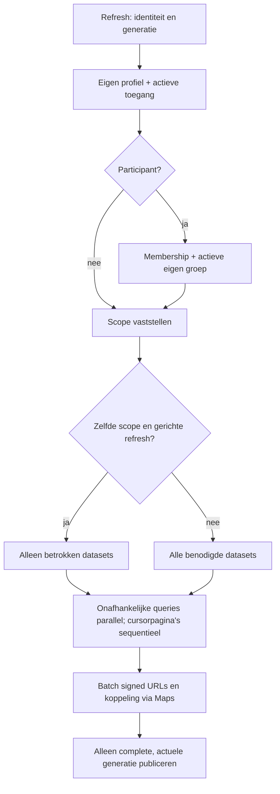

# CSI HIT — Performance, Scale & Game-Weekend Load Hardening

Datum: 29 september 2026. Status: lokaal checkpoint vóór hosted validation. Basis: `8ef8beec9b76859cc4f858f34898d5def3b22d67`. Branch: `hardening/performance-scale`.

## 1. Executive summary

De lokale fase vindt en herstelt stille truncatie boven de API-rowlimit, herhaalde volledige datalaadcycli en zware pegel-/aanwijzingenlijsten. Geen spelregels, SQL-migraties, RLS/grants, dependencies of productie-instellingen gewijzigd. De wijzigingen behouden de bestaande autorisatie- en mutatieprocedures. Ongewijzigde private foto-URLs worden binnen hun geldigheid hergebruikt, uitsluitend in de state van dezelfde toegangscontext.

**Klaar voor hosted performance validation – CSI HIT TEST moet worden hervat.** Dit is het gevraagde stoppunt van fase 46. Veilige capaciteit voor het spelweekend is nog niet bewezen. De resterende hosted fasen 47–57 staan in het [draaiboek](../tests/performance/README.md). Geen Productionrelease binnen deze opdracht.

## 2. Verwacht spelgebruik

Read-only inventarisatie bij start: zes actieve groepen, zeven participantaccounts, twee adminaccounts, twee suspectaccounts, acht actieve verdachtendossiers en geen juryaccounts. Dit zijn configuratieaantallen, geen aanmeldlijst of capaciteitsvraag. Er zijn geen namen of e-mailadressen uit Production opgehaald.

Voorlopige aanname zolang de organisator de aantallen niet heeft bevestigd: zes groepen × drie telefoons = achttien participantapparaten, acht verdachteapparaten, vier juryapparaten en twee beheerapparaten = 32 apparaten. Gemiddeld 1,25 open tabs geeft circa **40 actieve sessies/Realtime-verbindingen**. Aantal personen kan veel hoger zijn dan aantal apparaten; een gedeeld account kan meerdere apparaten bedienen. Voorgesteld ontwerpdoel: **50 actieve sessies**, hosted testplafond **100**, uitsluitend na gezonde lagere treden. Geen van deze getallen is al een operationeel maximum.

| Rol | Werkelijk aanwezige kernflows | Databereik |
|---|---|---|
| Participant | dashboard, verdachten/clues, notities/status, betaalde aankoop, refresh | eigen actieve groep, gemaskeerde clues |
| Suspect | eigen dossier, groepsnotities/status, agenda/navigatie | bestaande suspect-RLS; geen algemene transactielijst |
| Jury | dossiers, clue vrijgeven, pegelcorrectie, groepen vergelijken | jury-RLS, geen beheer/reset/backuprechten |
| Admin | spelmonitoring, beheer, instellingen, backupstatus, uitzonderingen | volledige toegestane datasets; backuphealth via begrensde RPC |

## 3. Baseline

Vóór bronwijzigingen gemeten met de echte lokale backend, gebouwde Vite-app, Chromium, viewport 390×844. Loginmeting omvat laden van assets, geautomatiseerd invullen en wachten tot de uitlogknop bruikbaar is. Iedere rol krijgt een eigen context; na initialisatie en schermwissels volgt 22 s idle (publieke pagina's 1 s). Latencywaarden zijn labwaarnemingen, geen statistisch gevalideerde SLA.

Oorspronkelijk: landing 129 ms, login 98 ms; participant 970 ms, suspect 415 ms, jury 372 ms, admin 433 ms. Totale backendrequests per sessie respectievelijk 60/49/61/65 voor de vier ingelogde rollen; daarin zitten login, Storage en twee idle-polls. De fixture bevat veel meldingen: participant idle downloadde circa 617 kB aan gedecodeerde backendresponses. Dit is geen verwachting voor iedere echte groep.

Een herhaalde vergelijking vanuit Git `8ef8bee` en de gewijzigde loader/refreshbron gebruikt dezelfde fixtures zonder muterende tests ertussen. De later begrensde cluekaarten worden apart op dezelfde grote fixture voor/na gemeten in §10; de normale profiler bezoekt die clueweergave niet. Zie de volgende automatisch samengevatte metingen en [machineleesbare meetgegevens](performance/measurements.json). Volledige ruwe logs blijven onder genegeerde `.local/performance/`.

<!-- MEASUREMENTS START -->
| Rol | Bruikbaar vóór → na (ms) | Backendrequests vóór → na | Idle requests vóór → na (22 s) | Idle responsebytes vóór → na |
|---|---:|---:|---:|---:|
| landing | 145 → 132 | 0 → 0 | 0 → 0 | 0 → 0 |
| login | 99 → 102 | 0 → 0 | 0 → 0 | 0 → 0 |
| a | 966 → 961 | 60 → 44 | 30 → 12 | 620356 → 3578 |
| suspect | 436 → 349 | 49 → 32 | 24 → 12 | 5080 → 2412 |
| jury | 445 → 344 | 61 → 35 | 30 → 12 | 21002 → 4222 |
| admin | 495 → 464 | 65 → 45 | 32 → 12 | 705800 → 4328 |

Landing/login gebruiken 1 s idle. Backendrequests omvatten auth/REST/Storage; bytes zijn gedecodeerde responsebytes, geen gemeten internet-egress. Volledige snapshots vóór optimalisatie kunnen afgekapt zijn; na optimalisatie worden alle pagina’s geladen. Dit verklaart een deel van extra initial requests.

Lokale tien-sessiesrun: 60.01 s workload, 68.52 s inclusief setup/cleanup; 775 requests, 11.31/s over de hele run; fouten 0. Snapshot p50/p95/p99 **48.91/209.33/235.18 ms**, request p95 **41.73 ms**, 20 joins inclusief reconnect. Dit is lokale API-/Realtime-validatie, geen hosted capaciteitsgrens.
<!-- MEASUREMENTS END -->

De eerste detector telde gelijke endpointpaden binnen 1,5 s; dat bewijst geen identieke query, omdat eigen profiel/adminlijst en verschillende cursorpagina's hetzelfde pad gebruiken. De herhaalde profiler vergelijkt daarom hashes van methode, volledige URL en body. Identieke reads bij de eerste subscription blijven deels bewust nodig om wijzigingen tussen snapshot en subscription op te vangen. Formulierblur zonder wijziging veroorzaakt nu nul reads, afzonderlijk bewezen in een browserregressie.

## 4. Gevonden bottlenecks

- Ongelimiteerde `.select('*')` stopte bij 1.000 rijen: de grote fixture leverde precies 1.000 transacties, notities en clues, zonder foutmelding.
- Elke idle-poll laadde het hele spel; ieder Realtime-event plande opnieuw een volledige laadcyclus. Een ongewijzigd formulier verlaten triggerde eveneens een full refresh.
- Afzonderlijke signed-URL-aanvragen en sequentiële datasets verlengden de waterfall. Dubbele `SIGNED_IN`-events konden opnieuw laden.
- Grote pegelhistorie bouwde circa 7.699 DOM-elementen op. De gemeten schermwissel duurde circa 201 ms.
- Een volledige snapshot had een limiet van 8 s; op het trage lokale netwerk werd admin niet bruikbaar. Paginering mag bij een latere fout geen gedeeltelijke data publiceren.

## 5. Wijzigingen

`readAllRows` zorgt voor expliciete keysetpaginering. `loadAppSnapshot` hercontroleert profiel en membership en hergebruikt alleen state van dezelfde gebruiker/rol/groep. Onafhankelijke datasets lopen parallel. Foto-URL's worden per batch ondertekend. `refreshQueue` bundelt dirty-tabellen gedurende 300 ms, bewaart events tijdens typen of busy state en voert achtergrondrefreshes achtereenvolgens uit. Geen gedeelde cache of nieuwe dependency.

`App.jsx` gebruikt gerichte eventrefresh, een lichte poll iedere 10–11 s en volledige reconciliatie na circa 60 s. Bij ontbrekende Realtime-verbinding blijft de volledige poll beschikbaar. Online/visibility, accountwissel, handmatige refresh en eigen mutaties behouden volledige actualisatie. De eerste subscription en reconnect halen alle zeven geabonneerde datasets opnieuw op om het subscriptiongat te sluiten. Alle snapshots hebben een begrensde deadline van 30 s: ook een gerichte subscription-refresh kan een grote gepagineerde dataset bevatten. De laatste trage-netwerkproef wees uit dat de eerdere 8 s-grens daar nog sync-fouten veroorzaakte; deze grens is daarom gelijkgetrokken. Een fout bewaart zichtbare laatste data en zet spelmodus op onbekend; serverautorisatie blijft beslissend.

## 6. Queryoptimalisatie

Queries op groeiende datasets staan centraal in de loader. De drie overige `.select('*')`-plaatsen in `App.jsx` retourneren uitsluitend zojuist ingevoegde, begrensde demofixtrijen; ze downloaden geen groeiende tabel. Profielupdate vraagt één ID terug. Eigen profiel is één rij; membership is begrensd door de bestaande unieke user-ID. Admin/jury blijven datasets lezen die dashboards en exports werkelijk gebruiken. Alleen visuele lijsten beperken zonder de datalaag compleet te houden zou exports/saldo-overzichten breken.

Model bij kleine datasets (één pagina per dataset, één fotobatch, actief tabblad, stabiele Realtime): participant volledige snapshot ongeveer 13 backendcalls inclusief signing, gerichte metadata-poll 6 zolang foto-URLs geldig blijven; admin ongeveer 15/6, plus backuphealth iedere 30 s. Fotovernieuwing voegt een signingcall en eventueel een image-GET toe. De veiligheidshercontrole op profiel/membership wordt bewust niet gecachet. Elke extra 250 rijen in een geladen dataset voegt een cursorrequest toe; exact multiples kunnen een lege eindpagina vergen.

Conservatief rekenmodel voor deelnemers, exclusief login, events en mutaties: voorheen 6 × 15 = **90 calls/min/client** voor de oorspronkelijke fixture inclusief twee signingcalls en één zichtbare image-GET per poll; nu 5 × 6 + 13 + 1 image-GET = **44/min/client**. Het nieuwe model rekent voorzichtig op één fotovernieuwing per minuut terwijl ongewijzigde URLs normaal circa vier minuten meegaan. Werkelijke 10–11 s jitter verlaagt het gemiddelde iets. Gebruik de gemeten endpointtellingen voor de concrete fixture; dit model schaalt niet lineair naar grote datasets of hosted compute.

| Actieve apparaten met één tab | Oud model calls/min | Nieuw model calls/min | Nieuw gemiddeld calls/s |
|---:|---:|---:|---:|
| 10 | 900 | 440 | 7,3 |
| 25 | 2.250 | 1.100 | 18,3 |
| 50 | 4.500 | 2.200 | 36,7 |
| 100 | 9.000 | 4.400 | 73,3 |

Navigatie zonder een mutatie vraagt geen nieuwe dataset. Een groep/saldo-event kan bij een participant volstaan met profiel + membership; een mutatie kan meerdere tabellen raken. De queue neemt daarvan de unie. Een eigen schrijfactie behoudt volledige refresh voor correctness. Parallelisatie verlaagt waterfallduur maar verhoogt de korte querypiek; de hosted ramp moet dat effect op Nano-compute nog beoordelen.

## 7. Pagination

Cursor op unieke `id`, of `key` voor settings; pagina's van 250, eerste pagina met exact count. Ook bij een lagere server-rowlimit gaat de helper door. Een ongeldige/teruglopende cursor, abort of fout op een latere pagina breekt de hele snapshot af. Maximaal 200 pagina's, daarna een expliciete fout in plaats van afgekapt publiceren. De bestaande displaysortering wordt na de volledige fetch hersteld.

Grote lokale fixture: oud 1.000/1.000/1.000; nieuw **1.508 transacties, 1.205 notities, 1.102 clues**, inclusief bestaande fixtures. Alle 1.500/1.200/1.100 deterministische IDs en alle 2.500 auditfixture-IDs zijn afzonderlijk gecontroleerd. Transactiesommen zijn correct en de toegevoegde transacties zijn netto nul. Laatst gemeten loaderduur: oud 346 ms voor onvolledige data, nieuw 675 ms voor volledige data. Dit is een correctnessverbetering, geen latencywinst claimen bij ongelijke hoeveelheden data.

Audit/backupstatus wordt niet als onbegrensde browserlijst geladen. Backupcapture gebruikt de bestaande server-side snapshotprocedure; de hersteltests bewijzen die route opnieuw. Paginering is geen databasebrede point-in-time snapshot: gelijktijdige insert/delete kan tussen cursorpagina's veranderen. De volgende reconciliatie corrigeert dit. Voor een consistente operationele backup blijft de bestaande backup-RPC leidend. Zeer grote volledige exports blijven een mogelijk toekomstig server-side werkpunt; daar is nu geen nieuwe RPC voor ingevoerd.

## 8. Indexes/queryplans

Lokaal `EXPLAIN (ANALYZE, BUFFERS)` als authenticated admin met dezelfde RLS en grote fixture, uitsluitend lokaal:

| Query, eerste 250 op ID | Plan | Execution time |
|---|---|---:|
| transacties, group-ID | bitmap op `idx_credit_transactions_group_id`, heap/RLS, sort | 24,864 ms |
| notities, group-ID | `idx_suspect_notes_group_id`, RLS, sort | 16,316 ms |
| audit op ID | `operation_audit_pkey` | 1,806 ms |

Bestaande membership-, group-, suspect-, timestamp- en unieke action-ID-indexes zijn aanwezig. De gefilterde plannen gebruiken bestaande indexes; de sort kost bij deze fixture relatief weinig naast de geautoriseerde scan. Geen gemeten indexbottleneck die een extra migratie rechtvaardigt. Geen index/RPC-migratie toegevoegd. Dit bewijs geldt niet voor honderdduizenden rijen of Nano onder load; hosted slow-querydata kan een later indexbesluit rechtvaardigen.

## 9. Realtime

Per ingelogde client één channel met zeven Postgres Changes-bindings: groups, group_clues, notifications, credit_transactions, agenda_items, suspect_notes en suspect_statuses. Bestaande RLS begrenst eventtoegang. Geen nieuwe subscription op `clues_base`: die tabel bevat onderliggende cluegegevens en de veilige gemaskeerde view blijft leidend. Settings en metadata blijven via polling actueel.

Voorheen leidde ieder ontvangen event tot een full refresh na 1 s trailing debounce; events tijdens typen werden weggegooid. Nu: vaste 300 ms bundelperiode, dirty-set, maximaal één achtergrondrefresh tegelijk en één vervolg voor events tijdens de lopende refresh. Polling/reconciliatie vangt gemiste events/deletes op. De periodieke veiligheidspoll blijft ook tijdens formulierfocus lopen: conceptvelden blijven behouden, terwijl saldo/toegang niet onbeperkt achterblijven. Dit heeft een eigen browserregressie. Niet verborgen op de achtergrond blijven ophalen; een zichtbaar geworden tab vraagt actuele data.

Vijf lokale group-events in één transactie convergeren in de browser met maximaal zes REST-reads; de testgrens is acht seconden inclusief lokale backend. Vijf login/accountwissels leveren steeds één actieve channel en nul na logout. Offline/online houdt de refreshburst onder veertig reads. Dit zijn beperkte regressies, geen hosted storm- of 30-minutenleakbewijs.

## 10. Frontend/rendering

De gemeten transactielijst toont initieel 50 rijen, per klik 50 meer. Volledige data blijft in state voor cijfers en export. Zelfde grote fixture: **7.699 → 410 DOM-elementen**, schermwissel **201 → 62 ms**.

De aanvullende grote-lijstenproef vond hetzelfde probleem bij clues. Alleen de zichtbare kaarten in admin/participant zijn per categorie begrensd op 50 met een knop voor meer; categorieaantallen, betaalbaarheid en de volledige admin-toewijzingskeuze blijven intact.

| Scherm met 1.102 clues | Voor | Na | DOM voor → na |
|---|---:|---:|---:|
| Admin aanwijzingen | 298 ms | 94 ms | 13.331 → 1.782 |
| Participant aanwijzingen | 344 ms | 62 ms | 14.411 → 762 |

De browserregressie controleert op beide rollen de initiële grens en doorgaan naar 100 aanwijzingen, naast de pegelhistorie. Een suspect met 1.208 notities had circa 4.984 DOM-elementen en werd lokaal in 2,59 s bruikbaar; recente notities zijn al begrensd tot drie en groepsdossiers blijven compleet. Daar is geen extra renderingwijziging voor ingevoerd; hosted mobiel kan nog andere knelpunten tonen. Audit wordt niet als lange browserlijst geladen en de groepslijsten zijn bij de fixture klein.

Reactcommits, TaskDuration, JS heap en DOM zijn via test-only instrumentatie verzameld. Geen grote contextrefactor, algemene memoization of virtualisatie: daarvoor is nog geen afzonderlijk profielbewijs. Review van hooks, cleanup, stable keys en stategebruik uitgevoerd met de React-best-practicesrichtlijnen. Profilerhooks worden niet in de productiebuild opgenomen.

## 11. Bundle/assets

Baseline JS 607,59 kB, gzip circa 162,21 kB; gewijzigde build circa 611,56 kB, gzip 163,52 kB (dezelfde Vite-buildmeting). CSS circa 0,40 kB / gzip 0,24 kB. Groei circa 4,0 kB ongecomprimeerd en 1,3 kB gzip door correctheids-/queuecode; geen nieuwe packages. Grootste bijdragen vóór chunkminificatie: React DOM, App.jsx, Supabase Auth, Phoenix/Realtime en Storage. `bundle-profile.mjs` legt modulegroottes en de daadwerkelijk geschreven assetgroottes vast zonder shipped instrumentatie. Die modulegroottes zijn geen optelbare gzipbijdragen; de in-memory analysebuild kan een iets andere minificatie/compressie hebben.

Geen code-splittingwijziging: bundling/lazy-loading vraagt ook chunkfailure- en deploy-skewafhandeling; daarvoor ontbreekt nu meetbewijs van netto winst. Private foto's/downloads en signed URLs blijven behouden; batch signing vermindert het aantal signingcalls zonder publieke bucket. URLs verlopen na 300 s en worden tijdens actieve synchronisatie vernieuwd. Bestaande uploadvalidatie en veilige URL-pathcontrole blijven actief. Geen Productionbestanden gedownload voor assetinventarisatie.

Een aanvullende read-only Storage-aggregatie (2 s querylimiet, geen objectnamen/content) vond in Production één foto van **490.446 bytes**, plus zeven cluebestanden samen 704.048 bytes, grootste 140.728 bytes. De profiler toonde foto-GETs bij polling doordat signed URLs veranderden. Nu blijven URLs maximaal 240 s gelijk, met 60 s marge op hun geldigheid van 300 s. Nieuw pad, gewijzigde scope, logout en vervaldatum dwingen opnieuw ondertekenen af. Alleen de huidige foto-URLs blijven in het geheugen; geen lokale opslag/global cache. Een bestaand object extern onder hetzelfde pad overschrijven kan daardoor tot de volgende vernieuwing oud beeld tonen; app-uploads gebruiken nieuwe objectpaden. Twee regressies controleren vernieuwing, scope-/padwissel en een onvolledige signingbatch.

Het statische logo is 30.338 bytes, favicon 35.611 bytes en font 12.960 bytes. Er is geen meetreden voor een nieuwe imagepipeline. Productiefotoresoluties zijn niet uit bestanden gelezen; gebruik van realistische foto's en private downloads blijft onderdeel van hosted mobiel testen. Uploadgrenzen (10 MiB foto, 25 MiB cluebestand) zijn veiligheidsgrenzen, geen performance-aanbeveling.

Vercel serveert contenthash-assets; lokale testserver gebruikt `no-store` en geen gzip. Trage simulatie (200 ms latency, 50 kB/s, CPU ×4) kost daarom alleen voor de JS-bundle al circa twaalf seconden. De eerste baseline-admin werd niet bruikbaar binnen de testlimiet. Een tussenmeting vond daarna nog een gerichte-refresh-timeout bij participant/admin; beide rollen zijn na de snapshotcorrectie opnieuw geslaagd zonder zichtbare sync-fouten: participant 23.294 ms, admin 24.316 ms. De laatste formulierfocus-safeguard verandert deze read-only flows niet en krijgt daarnaast een eigen browsertest. De meetgegevens onderscheiden de runs expliciet. Dit is geen acceptabele echte mobiel-SLA en ook geen bewijs dat Vercel zo langzaam is. Hosted mobiel met CDN/compressie blijft verplicht.

## 12. Loadtestontwerp

Eigen compacte harness met reeds aanwezige Supabase SDK, Node en Playwright; geen extra loadframework. Vier profielen A/B/C/D, rolverdeling, fictieve seed, veiligheid en exacte commando's staan in het [draaiboek](../tests/performance/README.md). De CLI accepteert alleen loopback of de exacte TEST-ref. Production, andere hosts, redirects, onbegrensde duur/concurrency, lokale writes en lokale stress worden geweigerd.

Praktische budgets voor de hosted validatie: individuele read p95 ≤750 ms, snapshot p95 ≤3 s, mutatie p95 ≤2 s, event→zichtbaar p95 ≤3 s, normale mobiele eerste bruikbaarheid ≤5 s en warme schermwissel ≤200 ms. Metadata/settings zonder event mogen circa 11 s + querytijd nodig hebben. Geen nieuwe backendfouten of integriteitsafwijkingen accepteren; 429/5xx/Realtime-fouten stoppen direct. Deze budgets zijn acceptatiecriteria, geen al bewezen resultaten.

Read-ramp 5/10/25/50/75/100, 120 s per trede. Schrijftest begint bij tien; controleert twee groepen, kleine schrijfmix en idempotency. Reconnect apart, vervolgens browser-E2E onder achtergrondreads en een soak van vijftien minuten op een gezonde trede. Verwachte totale hostedduur 45–60 minuten bij gezonde setup. Maximaal honderd, geen verplicht te halen doel.

## 13. Hosted loadresults

**Niet uitgevoerd: TEST is INACTIVE.** Nog geen hosted p50/p95/p99, throughput of errorrate per concurrency. De lokale tien-sessiesmeting in §3 gebruikt dezelfde applicatieloader en echte lokale Realtime, maar andere compute/netwerk/limieten. Die cijfers mogen niet als Supabase Free-capaciteit worden geciteerd.

## 14. Realtime load

Lokale channel lifecycle, vijf-eventburst en reconnect zijn groen. Gehoste quota, eventfanout, global/hotspotconvergentie en reconnect op 25–100 sessies zijn open. Eén creditactie kan groups, transacties en meldingen veranderen; bij vijftig gerechtigde ontvangers zijn dat conservatief 150 afleveringen. Dat kan de Free-eventlimiet raken, ook met perfecte REST-coalescing. RLS verkleint het werkelijke ontvangersaantal, maar vervangt de meting niet.

## 15. Data-integriteit

Lokale atomiciteit, dubbele aankoop, verloren antwoord, action-ID-retry, saldi, RLS en backup/restore opnieuw groen. Paginering controleert complete IDs, sortering en transactiesom. Bij herhaalde lokale seeds overschreed de opgebouwde auditgeschiedenis de expliciete 200-paginagrens: de helper gaf correct een fout, geen gedeeltelijke lijst. De fixture-cleanup verwijdert nu ook de auditregels van uitsluitend eigen deterministische targets; de auditpagineringstest leest de 2.500 eigen fixture-rijen. Hosted schrijftest is voorbereid met saldo vóór/na, unieke transacties, aankoopregistraties, notities en auditverificatie, maar nog niet uitgevoerd. Geen dataconsistentie onder hosted load claimen.

## 16. E2E onder load

Volledige lokale browserregressie zonder achtergrondload groen. Mobiele viewport en gesimuleerde vertraging/offline worden lokaal gebruikt. Gelijktijdige hosted E2E onder deelnemersload volgt na de baseline/ramp; destructieve tests mogen nooit tegelijk lopen met de integriteitsmeting van de schrijftest.

## 17. Soak test

Nog niet uitgevoerd. Gepland: vijftien minuten profiel A op de gezonde ontwerpconcurrency; maximaal dertig minuten per run. Vergelijk p95 per tijdvak, actieve connections, reconnects en browsergeheugen/channel counts aan begin/eind. Verleng alleen wanneer een concrete onzekerheid dit rechtvaardigt.

## 18. Bewezen capaciteit

Lokaal: tien API-sessies met tien echte lokale Realtime-connecties, gedurende zestig seconden profiel A en een begrensde reconnect, plus afzonderlijke browserregressies. Zie §3 voor de meetwaarden en eventuele beperkingen. **Bewezen hosted capaciteit: nog onbekend.** Vijf hergebruikte accounts zijn geen tien unieke personen.

## 19. Aanbevolen veilige capaciteit

Nog geen verantwoord operationeel maximum. Beslis na hosted validatie: kies maximaal circa 60% van de hoogste trede die reads, writes, Realtime, E2E en soak zonder budgetoverschrijding haalt, en houd apart minimaal 50% ruimte onder de connectionlimiet. Check óók message-rate, compute en bandwidth. Een net geslaagde honderd-sessietest is niet automatisch een veilige honderd-sessiegrens. Ontwerpdoel vijftig moet met deze marge worden onderbouwd; anders gebruik beperken of een technisch planbesluit voorbereiden.

## 20. Platformlimieten

Op 29 september live geverifieerd: Supabase-organisatie Free (`tier_free`), Vercel-team Hobby. Geen plan gewijzigd.

| Onderdeel | Actuele relevante grens | Betekenis voor CSI HIT |
|---|---|---|
| Supabase Realtime Free | 200 concurrent connections; 100 messages/s; 100 joins/s; 100 channels/connection | tabs en fanout tellen; geen garantie op deze capaciteit |
| Free maandquota | 2 miljoen Realtime messages, 500 MB database, 1 GB Storage, 5 GB ongecachede + 5 GB gecachede egress | maandgebruik en downloads controleren |
| Nano database | gedeelde CPU, maximaal 0,5 GB RAM; 60 databaseconnections, 200 poolerclients | REST-browsers delen backendpools; geen 1:1 browser/DBconnection |
| REST | API requests niet als laag maandquotum begrensd; row cap bestaat | compute, RLS, queryduur en egress blijven grenzen |
| Supabase Edge Free | 256 MB, 150 s wall clock, 2 s CPU/request; 500.000 invocations/maand | backupfunctie; niet ieder spelrequest is een Edge-call |
| Vercel Hobby | 100 GB Fast Data Transfer; Functions met Fluid tot 300 s / 2 GB | app hoofdzakelijk statisch; Supabase is de primaire loadgrens |

Bronnen: [Realtime limits](https://supabase.com/docs/guides/realtime/limits), [Postgres Changes en autorisatiekosten](https://supabase.com/docs/guides/realtime/postgres-changes), [Supabase pricing](https://supabase.com/pricing), [compute/databaseconnections](https://supabase.com/docs/guides/platform/compute-and-disk), [egress](https://supabase.com/docs/guides/platform/manage-your-usage/egress), [Edge limits](https://supabase.com/docs/guides/functions/limits), [Vercel Hobby](https://vercel.com/docs/plans/hobby), [Vercel Functions](https://vercel.com/docs/functions/limitations).

Een begrensde read-only Productioninventarisatie (`statement_timeout=2s`) rapporteerde max_connections 60 en database circa 14,2 MiB. Bestaande logs van de laatste 24 uur waren zeer schaars (onder meer 47 edge-logevents); daarmee is geen representatieve spelpiek of p95 bewezen. Geen ANALYZE, synthetische client, load of mutatie op Production uitgevoerd.

## 21. Planadvies

Free/Hobby kan niet uitsluitend op basis van 40 verwachte sessies worden goedgekeurd: Realtime-messagefanout en Nano/RLS-latency kunnen eerder begrenzen dan 200 connections. Geen upgradeadvies zonder hosted bewijs en actuele maandconsumptie. Na de ramp en soak beslissen of de huidige infrastructuur met marge voldoet, gebruik moet worden beperkt of een gemotiveerde upgrade-review nodig is. Geen upgrade uitgevoerd.

## 22. Pre-event test en observatie

Het draaiboek bevat een herhaalbare vijf-sessies/120 s TEST-smoke vóór Pasen 2027, met reconnect, beperkte writes en integriteitscontrole. Controleer dan opnieuw planlimieten en verwachte deelnemers/apparaten/tabs.

Tijdens het spel: één beheerder volgt Supabase REST p95/errors/429, database CPU/memory/pooler en Realtime active connections/messages/disconnects; een tweede controleert een normale mobiele spelclient. Bestaande clientdiagnostiek categoriseert sync/mutatiefouten, release en scherm zonder payloads; backuphealth toont stale/failed backups. Vercel request-/errorgrafieken en cronlogs zijn aanvullend. Geen nieuw observabilityplatform. Free bewaart logs kort: leg geaggregeerde incidenttijd en metrics tijdig vast.

Waarschuw bij twee minuten verhoogde p95 of opvallende sync-fouten; bij ontbrekende saldoconvergentie/dubbele boeking onmiddellijk incidentprocedure. Vermijd een massale refreshinstructie: die vergroot de piek. Gebruik het [bestaande game-day runbook](GAME-DAY-INCIDENT-RUNBOOK.md) voor operationele beslissingen; voer tijdens het spel geen loadtest op Production uit.

## 23. Tests

Schone `npm ci`; hoofdgate met unit/static/lint/secrets/build/diff-check; npm audit nul. Volledige suites sequentieel op de geïsoleerde lokale database:

| Suite | Geslaagd |
|---|---:|
| Vitest | 49 |
| Static/config/recovery/privacy/performanceguard | 41 |
| Core database | 28 |
| Security/auth/privacy | 31 |
| Recovery database | 21 |
| Recovery handler | 6 |
| Browser E2E incl. responsive | 22 |
| Security browser | 8 |
| Recovery browser | 2 |
| Performance data/browser | 6 |
| Totaal uitvoeringen | 214 |
| Uniek (vier privacytests draaien in twee suites) | **210** |

191 bestaande unieke tests + negentien nieuwe (tien unit, drie guards, één grote-datasetintegratie, vijf browserregressies). Geen fragiele milliseconde-unitassertions. Aanvullende profielen/loadmetingen tellen niet als nieuwe unit-tests. Hosted schrijftest, ramp, Preview, soak en E2E onder hosted load staan nog open.

## 24. Git

Branch `hardening/performance-scale`, basis exact `8ef8bee`; de checkpointcommit bevat dit rapport en de wijzigingen. De uiteindelijke hash staat in het opleverbericht; reproduceer met `git rev-parse HEAD`. Geen commit op main, geen push/Preview vóór het hosted checkpoint. CI voor deze lokale branch is daarom nog niet uitgevoerd; de lokale quality gate is wel groen. `origin/main` blijft de gevalideerde basis.

Gewijzigd: package scripts, App.jsx, AppBlocks.jsx, AdminClues.jsx, ParticipantClues.jsx, centrale snapshotloader en bestaande loader-mock; drie bestaande browserhelpers accepteren expliciet de nieuwe TEST-Previewbranch. Nieuw: cursorhelper, refreshqueue, performance-unitregressies, lokale browser/datafixtures, profiler/bundleanalyse, begrensde load/ramp/schrijfharness, safetytests, hosted seed, draaiboek en meetrapport. README verwijst naar de fase. Geen SQL-, lockfile- of dependencywijzigingen. Authstate, `.local`, builds, backups en credentials blijven buiten Git.

## 25. Preview

Nog niet aangemaakt/gepusht in deze lokale fase. Pas na ACTIVE_HEALTHY een branchspecifieke Preview naar TEST en de juiste commit verifiëren. De productie- of algemene Preview-env niet gebruiken voor de loadharness. Bestaande security-/recoverybrowserhelpers zijn voorbereid op de expliciete `hardening/performance-scale`-branch.

## 26. Production

Productiondeployment blijft `dpl_FSrbhK4M2qobhLAo2hct3EP8iVw9`, commit `8ef8bee`. `main` blijft ongewijzigd. Alleen read-only control-planegegevens, begrensde inventarisatie en bestaande logs onderzocht. Geen productiequeries voor benchmarks, geen data/schema/historywijzigingen, geen accounts, geen deployment en geen env-/dashboardmutatie.

## 27. CSI HIT TEST / IScout

Control-planecontrole: TEST `ksnagauoufsriwplvvtd` **INACTIVE**, IScout `dhdhhesodxowsvvyicdg` **ACTIVE_HEALTHY**, Production **ACTIVE_HEALTHY**. Geen status gewijzigd. Het hervatten/pauzeren wacht op de gebruiker volgens het expliciete fase-46-checkpoint.

## 28. Resterende risico's

1. Nog geen veilige hosted capaciteit, write/hotspot/Supabase-quota-/soakbewijs of mobiel onder hosted load.
2. Volledige datasetloading is nu correct maar kost bij grote aantallen meer bytes/queries. Veel categorieën, expliciet alles uitklappen/laden en volledige exports blijven potentiële volgende hotspots; geen onbewezen brede UI-refactor gedaan.
3. Periodieke volledige reconciliatie voorkomt geen databasebrede snapshotisolatie; metadata/settings kunnen circa elf seconden later zichtbaar zijn. De algemene ctx-structuur blijft bestaan.
4. REST-coalescing verlaagt geen Realtime-messagefanout. De daadwerkelijke Free-rategrens moet in TEST worden geobserveerd.
5. Lokale API- en browserprofielen gebruiken andere compute en ongecomprimeerde assets; dat rechtvaardigt geen hosted SLA of planadvies.
6. Concurrentieaanname wacht op organisatorische aantallen. Gedeelde fixtureaccounts zijn geen honderd unieke accounts. Normale API-sessies en browser-E2E moeten in de hosted resultaten apart blijven staan.
7. Historische migrationregistraties blijven zoals na fase 4; geen blind repair/db-push. Schema is in deze fase niet gewijzigd.

## 29. Conclusie

**Nog niet gereed voor production-review.** Lokale datacompleetheid, minder onnodige full refreshes, begrensde rendering en regressies zijn bewezen. Capaciteit met marge vereist eerst de expliciet uitgestelde hosted TEST-ramp, schrijftest, Realtime-validatie, mobiele E2E onder load en soak. Daarna het rapport aanvullen en TEST zo snel mogelijk weer vrijgeven voor pauzeren; geen Productionrelease in deze opdracht.
